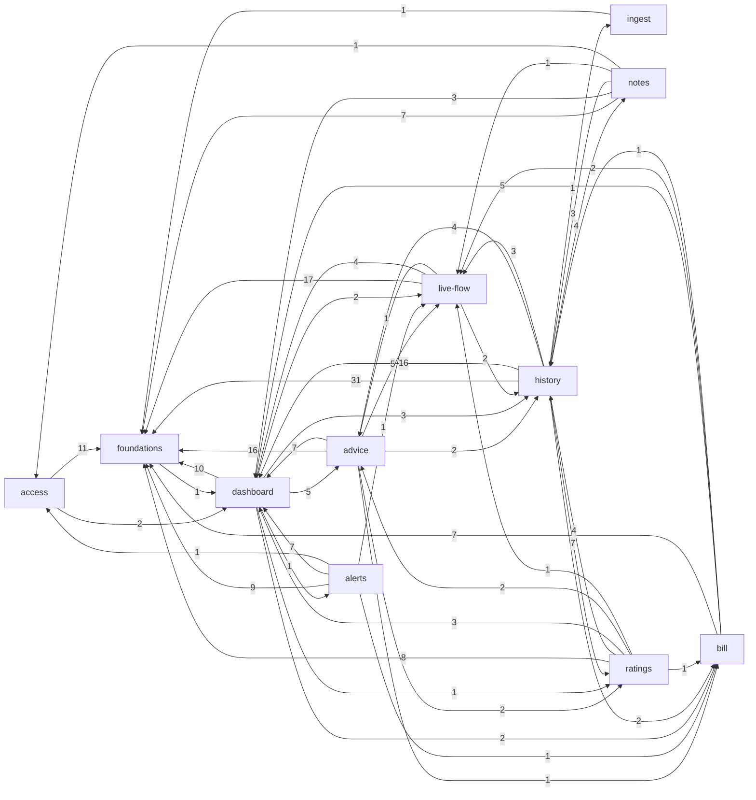
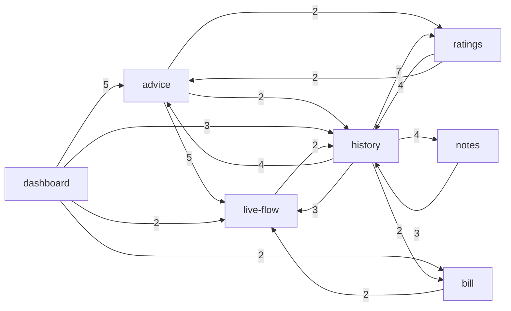

# Evidence: structure

Scope: tracked files of /dev-hub/projects/energy-analyser at head e630d36 (refresh of the map first built at e334854; 12 commits since). All numbers come from commands in this session (list at the end); attribution via `.work/capabilities.tsv` (now with the `alerts` capability).

## Graph sources

| Language                                                 | Source                                                                                                                                                                                                                                             | Level                 | Confidence  | Coverage / blind spots                                                                                                                                                                                                                                                                                                                                                        |
| -------------------------------------------------------- | -------------------------------------------------------------------------------------------------------------------------------------------------------------------------------------------------------------------------------------------------- | --------------------- | ----------- | ----------------------------------------------------------------------------------------------------------------------------------------------------------------------------------------------------------------------------------------------------------------------------------------------------------------------------------------------------------------------------- |
| TypeScript (.ts/.tsx)                                    | own script `.work/extract-edges.mjs` using the TypeScript compiler API from the project's installed `node_modules/typescript` (parses real import/export-from/`import()` nodes, resolves relative paths and the `@/*` alias from tsconfig by hand) | 2 (project toolchain) | medium-high | 202 files parsed in total (src, scripts, tests, configs; 42 of them .astro). `import type` and all-inline-`type` specifiers tagged `type`. No re-export barrel resolution beyond the direct `export ... from` edge. Dynamic `import()` with literal paths: 5, all in `*.load.test.ts`, unresolved (extensionless `./warsaw-time` etc.): 5 test-only edges lost.               |
| Astro (.astro)                                           | same script: frontmatter between `---` and `<script>` blocks extracted, parsed as TypeScript. YES, Astro files were parsed for imports: 42 .astro files, 233 import statements found.                                                              | 2                     | medium      | Template-level usage (components referenced without import, slots, `Astro.glob`, `import.meta.glob`) not seen; CSS import `src/layouts/Layout.astro -> ../styles/global.css` unresolved on purpose (1).                                                                                                                                                                       |
| SQL (supabase/migrations, 16 files)                      | none: SQL has no import graph                                                                                                                                                                                                                      | none                  | unknown     | Cross-capability coupling through tables, views, the `ingest_push`/`alerts_*` functions and the `ingest` schema helpers is not in the graph. Partial substitute: a hand-built table (below) from reading the migrations plus a `.from("<table>")` / `.rpc()` scan of src (grep-level, 27 non-test call sites; `.work/db-access-ts.txt` is the OLD 12-site list and is stale). |
| Bash (.claude/hooks, .husky), YAML (.github)             | none                                                                                                                                                                                                                                               | none                  | unknown     | Workflows run `npm` scripts or `scripts/alerts-trigger.mjs`; not graphed (`.github/workflows/alerts-evaluate.yml` is attributed to alerts).                                                                                                                                                                                                                                   |
| scripts/*.mjs (5), config .mjs/.ts, playwright.config.ts | included in the script's file list                                                                                                                                                                                                                 | 2                     | medium      | 0 edges from scripts or configs into src. The only edge touching a script is `src/lib/alerts-trigger.test.ts -> scripts/alerts-trigger.mjs` (test into script). `tests/e2e/*` import only `@playwright/test`, `pg`, node builtins and `tests/e2e/support/env.ts`: 0 edges into src.                                                                                           |

Dedicated tools: madge, dependency-cruiser, skott not in `node_modules/.bin` and no config in repo (not re-checked this run, taken from the first run); `tsc` and `astro` binaries exist but no project graph rules. Edges: 379 file-level (non-test) = 322 runtime + 57 type, 0 build. Test-to-src edges: 124 (kept separate in `.work/edges-tests-to-src.csv`; tests excluded from the capability graph). Mapped files: 0 unmapped nodes among all graphed files (evidence). `.work/cap-edges-detail.tsv` was regenerated with `fold.py`. `graph-metrics.mjs` is no longer in `.work`, so Ca/Ce below were recomputed with inline python from the same edge CSV (same definition: distinct capability neighbours).

## Capability graph

Runtime edges, 49 capability pairs (42 before). Ca/Ce are counted on capability nodes (distinct neighbours), instability = Ce/(Ca+Ce):

| Capability  |  Ca |  Ce | Instability | File edges in / out |
| ----------- | --: | --: | ----------: | ------------------- |
| foundations |  10 |   1 |        0.09 | 117 / 1             |
| live-flow   |   7 |   4 |        0.36 | 15 / 24             |
| dashboard   |   9 |   7 |        0.44 | 48 / 24             |
| bill        |   5 |   4 |        0.44 | 7 / 15              |
| access      |   2 |   2 |        0.50 | 2 / 13              |
| ingest      |   1 |   1 |        0.50 | 1 / 1               |
| history     |   6 |   8 |        0.57 | 15 / 68             |
| advice      |   4 |   6 |        0.60 | 12 / 33             |
| ratings     |   3 |   6 |        0.67 | 10 / 19             |
| notes       |   1 |   5 |        0.83 | 4 / 15              |
| alerts      |   1 |   5 |        0.83 | 1 / 19              |

`platform` and `docs` have no source files in the graph (docs: prose; platform: configs). Edge labels = number of file-level runtime import edges. New since the first run: `alerts` (19 outgoing file edges, 1 incoming) and `history -> ingest` (1, `hourly-usage.ts -> ingest/retention.ts`; ingest used to have Ca 0).

Full graph (all runtime edges, computed from `.work/cap-edges-detail.tsv`):

Trimmed, written to `.work/cap-graph-trimmed.mmd` (runtime only, edges into `foundations` and into `dashboard` removed because both hold shared presentational helpers, and edges with weight < 2 removed; 17 edges; `alerts`, `access`, `ingest` fall out because all their remaining edges are weight 1 or go into foundations/dashboard):

Note: the SQL/DB path (ingest writes `daily_energy`, `hourly_energy`, `period_summaries`, `recommendations`; live-flow, history, advice, bill, ratings, alerts read them) is NOT drawn because it is not in the import graph. See the SQL section below.

## SQL side (hand-built, not graphed)

Read from `supabase/migrations` (16 files, 2026-09-23 .. 2026-10-07). Function history: `ingest_push` is redefined in 6 migrations (push_ingestion, daily_forecast, hourly_energy, period_summaries, period_summaries_keep_narration, ingest_push_sections); only the last definition is live.

Objects and who writes / reads them:

| Object                                                                                                             | Kind                                                            | Written by                                                                                                                        | Read by (src call sites / SQL)                                                                                                                                                  | Capability(ies) depending on it                                                                                                           |
| ------------------------------------------------------------------------------------------------------------------ | --------------------------------------------------------------- | --------------------------------------------------------------------------------------------------------------------------------- | ------------------------------------------------------------------------------------------------------------------------------------------------------------------------------- | ----------------------------------------------------------------------------------------------------------------------------------------- |
| `ingest_tokens`                                                                                                    | table                                                           | `scripts/create-ingest-token.mjs` (prints insert); seed.sql                                                                       | `ingest_push`, `ingest_token_ok` (hash + `revoked_at`)                                                                                                                          | ingest                                                                                                                                    |
| `ingest_token_ok(p_token)`                                                                                         | function, anon, boolean only                                    | none                                                                                                                              | `src/pages/api/ingest.ts` (`rpc`, called before body validation, from the refactor)                                                                                             | ingest                                                                                                                                    |
| `ingest_push(p_token, p_payload)`                                                                                  | function, anon, security definer                                | `src/pages/api/ingest.ts` via `services/ingest.ts`                                                                                | calls `ingest.store_*` and `ingest.prune()`                                                                                                                                     | ingest (writes for live-flow, history, advice, bill, ratings, alerts)                                                                     |
| `ingest.store_daily / store_hourly / store_period_summaries / store_recommendation / prune`                        | functions in schema `ingest`, execute revoked from client roles | `ingest_push` only                                                                                                                | none                                                                                                                                                                            | ingest (internal; retention windows named at top of `prune()` and mirrored in TS by `src/lib/ingest/retention.ts`, which history imports) |
| `ingest_pushes`                                                                                                    | table (raw payloads, token_id, payload_hash hidden)             | `ingest_push`; pruned by `ingest.prune`                                                                                           | column-grant owner read; views `live_state`, `bill_forecast`; `alerts_snapshot`                                                                                                 | live-flow, bill, alerts, access (owner policy)                                                                                            |
| `daily_energy`                                                                                                     | table (+ `pv_forecast_kwh`, column grants)                      | `ingest.store_daily`                                                                                                              | `live-state.ts`, `calendar-data.ts`, `usage-insight.ts`                                                                                                                         | live-flow, history, advice (3 direct readers)                                                                                             |
| `hourly_energy`                                                                                                    | table                                                           | `ingest.store_hourly`; pruned                                                                                                     | `hourly-usage.ts`                                                                                                                                                               | history                                                                                                                                   |
| `recommendations`                                                                                                  | table                                                           | `ingest.store_recommendation`                                                                                                     | `recommendation.ts`, `calendar-data.ts`                                                                                                                                         | advice, history                                                                                                                           |
| `period_summaries`                                                                                                 | table                                                           | `ingest.store_period_summaries` (keeps narration)                                                                                 | `period-summary.ts`                                                                                                                                                             | ratings                                                                                                                                   |
| `live_state`                                                                                                       | view (security invoker) over `ingest_pushes`                    | none                                                                                                                              | `live-state.ts`                                                                                                                                                                 | live-flow                                                                                                                                 |
| `bill_forecast`                                                                                                    | view over `ingest_pushes`                                       | none                                                                                                                              | `bill-forecast.ts`                                                                                                                                                              | bill                                                                                                                                      |
| `app_owners`                                                                                                       | table                                                           | manual                                                                                                                            | every owner policy below; `alerts_snapshot` joins it                                                                                                                            | access (RLS for all reads)                                                                                                                |
| `day_notes` (+ `day_notes_set_updated_at` trigger fn)                                                              | table, client insert/update/delete grants                       | `src/pages/api/notes.ts`                                                                                                          | `calendar-data.ts` (bypasses `day-notes.ts`), `notes.ts`                                                                                                                        | notes, history                                                                                                                            |
| `alert_rules` (+ `alert_rules_set_updated_at`, `alert_rules_reset_state`, `alert_rules_enforce_limit` trigger fns) | table, client grants per column, owner policies                 | `src/pages/api/alert-rules.ts` (4 writes), `alerts_record` (state columns)                                                        | `services/alert-rules.ts`, `alerts_snapshot`                                                                                                                                    | alerts                                                                                                                                    |
| `alert_tokens`                                                                                                     | table, all client privileges revoked                            | `scripts/create-alert-token.mjs`                                                                                                  | `alerts_snapshot`, `alerts_record`                                                                                                                                              | alerts                                                                                                                                    |
| `alerts_snapshot(p_token)` / `alerts_record(p_token, p_results)`                                                   | functions, anon, security definer                               | called from `src/pages/api/alerts/evaluate.ts` (cron via `.github/workflows/alerts-evaluate.yml` -> `scripts/alerts-trigger.mjs`) | read `alert_rules` join `app_owners`, newest `ingest_pushes` with `state` and with `bill_forecast` (the filters of the two views, copied by hand); record updates `alert_rules` | alerts (depends on the ingest payload shape: `state`, `bill_forecast`)                                                                    |

Cross-capability DB coupling, `evidence` from migrations plus call sites unless marked:

- ingest -> everything on the read side: one payload change touches `ingest_push` plus up to 4 `store_*` functions plus the tables above.
- alerts -> ingest: `alerts_snapshot` re-implements the `live_state` and `bill_forecast` view filters directly on `ingest_pushes` (copied, not shared; `inference`: a change to the view filter or payload key silently diverges). It also depends on `app_owners` (access).
- alerts reads the same data in TS through `alert-evaluation.ts -> live-state.ts, bill-forecast.ts` (import edges, graphed), so the alerts evaluator sits on both the TS and the SQL path to ingest.
- `ingest.prune()` retention constants are in SQL and TS (`retention.ts`); `ingest-retention.test.ts` is the only guard (`inference`).
- Three capabilities read `daily_energy` directly; `day_notes` is read by notes and history.

## Blast radius per capability

All claims `evidence` unless marked.

- **ingest (high)**: incoming runtime edges 1 (history: `hourly-usage.ts -> src/lib/ingest/retention.ts`, evidence; was 0). Outgoing: `src/pages/api/ingest.ts` -> `services/ingest.ts` -> `ingest/contract.ts`, plus `supabase.ts` (1 edge to foundations). The endpoint is hit over HTTP, so real fan-out goes through SQL: `ingest_push` -> `ingest.store_*` -> tables that live-flow, history, advice, bill, ratings and (via `ingest_pushes`) alerts read: `inference` = a payload/contract/function change reaches 6 read capabilities. Since the refactor the route calls `ingest_token_ok` first, so token logic exists twice in SQL (`ingest_push`, `ingest_token_ok`); drift guarded by integration tests only. Tests: `tests/integration` import ingest 5 times (boundary, golden, retention) and 6 other capabilities. External consumer: the home lab pushes to `/api/ingest` with `docs/ingest/contract-v1.schema.json`; consumer code is in another repo = `unknown (external)`.
- **access (high)**: incoming 2 (notes: `api/notes.ts -> magic-link.ts` `SIGNIN_PATH`; alerts: `api/alert-rules.ts -> magic-link.ts`, same constant). Outgoing 2: foundations 11 and dashboard 2 (`Layout.astro`). `src/middleware.ts` imports only low-level files; owner enforcement lives in SQL (`app_owners` policies, now also used by alert_rules and `alerts_snapshot`), invisible to the graph (`unknown`).
- **live-flow (high)**: incoming from 7 capabilities (advice, alerts, bill, dashboard, history, notes, ratings; 15 file edges). Widely imported: `grid-sensor.ts` (Ca 8) and `live-state.ts` (now also imported by `alert-evaluation.ts`). Outgoing: foundations 17, dashboard 4, history 2 (`grid-sensor.ts -> calendar/period.ts`), advice 1 (`live-state.ts -> usage-insight.ts`).
- **bill (high)**: incoming 5 (dashboard, advice, history, ratings, alerts via `alert-evaluation.ts -> bill-forecast.ts`; 7 file edges). Outgoing: foundations 7, dashboard 5, live-flow 2, history 1 (`bill-forecast.ts -> format/period.ts`).
- **advice (medium)**: incoming 4 (dashboard 5, history 4, live-flow 1, ratings 2 file edges; 12 total). Outgoing 6: foundations 16, dashboard 7, live-flow 5, ratings 2, history 2, bill 1.
- **history (medium)**: widest fan-out: Ce 8 (adds ingest); incoming 6 (advice, bill, dashboard, live-flow, notes, ratings). `src/pages/dashboard/history.astro` imports 20 files (highest Ce in repo), `DayView.astro` 13, `MonthView.astro` 12, `calendar-view.ts` 11 (Ca 6). Shared contract: `calendar/period.ts` (Ca 8) and `format/period.ts`.
- **ratings (medium)**: Ce 6, incoming 3 (history 7 file edges, advice 2, dashboard 1). `period-rating.ts` imports from history, advice, bill and live-flow services (Ce 9).
- **notes (medium)**: incoming 1 (history 4 edges); outgoing 5 (foundations 7, dashboard 3, history 3, live-flow 1, access 1). Data coupling: `calendar-data.ts` queries `day_notes` directly, bypassing `day-notes.ts`.
- **alerts (new, medium)**: incoming 1 capability (dashboard: `DashboardHeader.astro -> services/alert-rules.ts`, 1 file edge, evidence). Outgoing 19 file edges to 5 capabilities: foundations 9, dashboard 7 (Layout and shared cards in `alerts.astro`, `AlertRulesPanel.astro`), bill 1 and live-flow 1 (`alert-evaluation.ts -> bill-forecast.ts, live-state.ts`), access 1. It is an almost pure leaf (instability 0.83) in code, but a consumer of two data loaders whose shape it must follow: a change to `bill-forecast.ts` or `live-state.ts` output now breaks alert evaluation, which runs unattended from cron (`inference`: failures are not seen by a page view). DB: owns `alert_rules`, `alert_tokens`, `alerts_snapshot`, `alerts_record`. Also the only capability with its own browser test layer (`tests/e2e/alert-rules.spec.ts`) and integration tests (`alert-rules.test.ts`, `alerts-evaluate.test.ts`, which also imports `bill-forecast.ts`).
- **dashboard (medium)**: incoming 9 (every other capability incl. alerts), outgoing 7: advice 5, history 3, bill 2, live-flow 2, alerts 1, ratings 1, foundations 10. Hosts shared UI (`CardHeading.astro` Ca 14, `StatusBadge.astro` Ca 17, `Layout.astro`), see Centres.
- **foundations**: incoming 10 capabilities (117 file edges); one reverse edge (below).

## Cycles

- File-level runtime graph: strongly connected components with more than 1 file = **0** (evidence; the `alerts` addition did not create one). No file loop.
- Capability-level graph: one connected cycle containing all 11 nodes (access, advice, alerts, bill, dashboard, foundations, history, ingest, live-flow, notes, ratings) via the `foundations -> dashboard` hook edge. `ingest` joined it with the new edge `history -> ingest`: history -> ingest -> foundations -> dashboard -> history (hand-traced from the edge list, not by a tool). It is a product of folding, not a code loop.
- Capability-level runtime 2-cycles by edge pairs (evidence, from the edge table, 14): advice<->dashboard, advice<->history, advice<->live-flow, advice<->ratings, alerts<->dashboard (new), bill<->dashboard, bill<->history, dashboard<->foundations, dashboard<->history, dashboard<->live-flow, dashboard<->ratings, history<->live-flow, history<->notes, history<->ratings. All go through composition components (cards import `CardHeading`/`Layout`, `DashboardBody`/`DashboardHeader` import the cards or services) or `period.ts` helpers; file-level they are layered. alerts<->dashboard is `DashboardHeader.astro -> alert-rules.ts` against alerts pages/components importing dashboard shared UI.
- Type-only cycle: foundations <-> dashboard/live-flow via `hooks/usePreference.ts -> lib/preferences.ts` (also runtime, 1 edge) and `useFlowLines.ts -> flow-geometry.ts` (type). Mechanical.

## Broken boundaries

Intended layering `inference`: foundations (types, format, ui, supabase, logger) -> services/lib (per capability) -> components -> pages (dashboard, history, alerts, api, auth).

1. foundations -> dashboard: `src/components/hooks/usePreference.ts` imports `src/lib/preferences.ts` (mapped to dashboard). The only upward edge from the base layer (1 runtime + 1 type), plus `useFlowLines.ts -> flow-geometry.ts` (type, live-flow). Unchanged since the first run.
2. Service-to-service reach across capabilities: `live-flow/live-state.ts -> advice/usage-insight.ts`; `ratings/period-rating.ts -> advice/usage-insight.ts, bill/complete-day.ts, live-flow/grid-sensor.ts, history/calendar/period.ts`; `advice/usage-insight.ts -> history/format/period.ts`; `bill/bill-forecast.ts -> history/format/period.ts`; `live-flow/grid-sensor.ts -> history/calendar/period.ts`; `history/hourly-usage.ts -> ingest/retention.ts` (new: read side imports an ingest-owned constant file); `alerts/alert-evaluation.ts -> bill-forecast.ts, live-state.ts` (new); notes api and alerts api -> `access/magic-link.ts` (`SIGNIN_PATH`, constant living in a service). Many cross edges are helpers (`period.ts`, `grid-sensor.ts`, `retention.ts`) that `capabilities.tsv` places inside a feature capability but behave as shared helpers (attribution issue, `inference`).
3. Cards reaching into other capabilities' components: advice -> live-flow `VerdictChip`, advice -> bill `RecommendationForecast`, history -> bill `RecommendationForecast`, history -> advice `AdviceBlocks`; `DashboardHeader.astro` (dashboard) -> alerts service. Composition, low risk.
4. Data-layer bypass: `history/calendar-data.ts` reads `day_notes`, `recommendations`; `live-state.ts` and `usage-insight.ts` read `daily_energy`. New in SQL: `alerts_snapshot` reads `ingest_pushes` directly with a hand copy of the `live_state`/`bill_forecast` view filters instead of selecting from the views.
5. ingest's boundary with the read side is the DB schema, not code; `history -> ingest/retention.ts` is the one code link and it is a constant. Contract/SQL sync is checked only by tests (integration, `contract.test.ts` for the JSON schema): `unknown` beyond that.

## Test risks

Tests are excluded from the graph; edge counts below are test -> src import edges (`.work/edges-tests-to-src.csv`, 124 edges): unit (co-located `src/**/*.test.ts`) 94, integration 30, e2e 0.

- Pure, cheap to unit test (few imports, mostly foundations): foundations (36 unit test edges), live-flow services (11), history calendar logic (10), advice (8), bill (6), alerts evaluation/rules logic (5 unit edges; `alert-evaluation.ts`, `alert-rules.ts`, `alerts-evaluate.ts`, plus `alerts-trigger.test.ts -> scripts/alerts-trigger.mjs`).
- Hard in isolation: `history` pages (`history.astro` Ce 20, `calendar-view.ts` Ce 11), `ratings/period-rating.ts` (Ce 9 across four capabilities), `dashboard.astro` (Ce 11), `AlertRulesPanel.astro` (Ce 9): need integration or e2e; heavy mocking of services and Supabase is fragile. Only 2 of 14 dashboard-mapped files are imported by any test.
- Integration layer (`tests/integration`, real local Supabase, 11 test files + `support/`): 30 test->src edges into history 8, ingest 5, live-flow 4, foundations 4, alerts 2, advice 2, bill 2, ratings 2, notes 1. Covers ingest->SQL->read-side (push-to-page, ingest-golden, ingest-boundary, ingest-retention, history-safety, notes-parity, seed), access (`access-abuse.test.ts`: 0 src imports, it exercises RLS over the wire) and alerts (`alert-rules.test.ts`, `alerts-evaluate.test.ts`: RPCs `alerts_snapshot`/`alerts_record`). `db-url-guard.test.ts` guards the destructive-DB safeguards. SQL-owned logic (`ingest_push`, `ingest.store_*`, `ingest_token_ok`, owner RLS, `alert_rules` triggers and limit) can only be tested here; unit tests with mocked clients cannot.
- E2E layer (`tests/e2e`, Playwright, Chromium): 4 files, 226 lines: `auth.setup.ts` (signs in a fresh owner), `seed.spec.ts` (seed), `alert-rules.spec.ts` (the alert-rules page), `global.teardown.ts` (deletes the user over Postgres 54322). 0 import edges into src, so the graph cannot say what it covers; by name it covers only alerts (and sign-in as setup). No e2e for dashboard, history, notes or ingest (`inference` from file list). Not part of `npm test`, `e2e` CI job is not a required check (CLAUDE.md).
- Supabase client (`src/lib/supabase.ts`, Ca 10, plus 8 for `query-error.ts`): global data client, every loader needs it mocked or a live stack.
- Files imported by at least one test, per capability (tested / non-test files in graph): foundations 11/19, history 8/17, live-flow 5/10, access 4/16, advice 3/9, alerts 5/9, dashboard 2/14, ingest 3/4, bill 2/4, ratings 2/5, notes 1/5. This counts files in the edge graph only (files with no import edges are absent), import reachability not coverage (`unknown` for line coverage).

## Centres and thin entry points

- Load-bearing contracts (high Ca, low instability): `src/lib/utils.ts` Ca 21, `format/warsaw-time.ts` 17, `ui/Panel.astro` 16, `format/status.ts` 15, `format/values.ts` 13, `lib/supabase.ts` 10, `query-error.ts` 8 (all foundations, Ce 0..1). Warsaw time and value formatting underlie money/boundary logic: change radius is repo-wide. Partly fan-in by design (`cn()`/`Panel` primitive), cheap if a typecheck catches signature breaks.
- Shared presentation inside `dashboard`: `StatusBadge.astro` Ca 17, `CardHeading.astro` Ca 14. They inflate dashboard Ca and every `x -> dashboard` edge: mapping artifact (`inference`). The alerts capability adds 7 of those edges.
- Cross-capability helper contracts: `live-flow/grid-sensor.ts` Ca 8, `history/calendar/period.ts` Ca 8, `alerts/alert-rules.ts` Ca 6 (the only alerts centre; imported inside alerts and by `DashboardHeader`), `history/calendar-view.ts` Ca 6. Candidates for foundations: grid-sensor, period, retention.
- Thin entry points: `src/pages/api/ingest.ts` (delegates; now also calls `ingest_token_ok`), `src/pages/api/alerts/evaluate.ts` (delegates to `alerts-evaluate.ts`, token-authenticated, cron-driven; core is `alerts_snapshot`/`alerts_record` in SQL), `src/pages/api/alert-rules.ts` (writes `alert_rules` directly from the route), `src/middleware.ts`, `src/pages/api/notes.ts`. Largest composers: `history.astro` (Ce 20), `dashboard.astro` (Ce 11), `RecommendationCard.astro` (10), `LiveFlow.tsx` (10), `AlertRulesPanel.astro` (9): orchestration layer, not the core.

## Mechanical signals

- Type-only edges: 57 of 379 (15%), kept out of the runtime graph. Top: `x -> foundations` (history 7, live-flow 5, alerts 4, advice 4, bill 3, ratings 3: `types.ts`), dashboard -> advice/bill/history/live-flow/ratings 1-2 each (props types for `DashboardBody`).
- Build edges: 0. Config-as-code: no config or script files import src; the one test->script edge is `alerts-trigger.test.ts`.
- `docs/ingest/contract-v1.schema.json` is generated from `src/lib/ingest/contract.ts` by `contract:export`; `npm test` fails on drift (CLAUDE.md). Mechanical, guarded.
- SQL migrations vs TS types: coupled by hand, no `supabase gen types` and no import edge; `src/types.ts` is hand-maintained. The new alert limits are "mirrored" by hand between the table check constraint (`live_stale` 15..1440 minutes, `bill_above` 1..7000 PLN) and TS validation (comment in the migration says so): `unknown` whether a test ties them. 16 migrations in 2 weeks; `ingest_push` redefined 6 times (copy-whole-function pattern, last one split into `ingest.store_*`).
- Duplicated SQL logic: view filters of `live_state`/`bill_forecast` copied into `alerts_snapshot` (two migrations, the second a review fix redefining both alert functions); token hash check in `ingest_push` and `ingest_token_ok`.
- `foundations -> dashboard` via hooks is attributable to path mapping.

## Unknowns

- SQL/DB coupling is only hand-built above; no tool, no migration-to-code mapping. Worth: `supabase db diff`, pgTAP, or the integration suite.
- JS/TS: `dependency-cruiser` or `skott` could cross-check the hand-built graph; neither parses Astro templates natively. Confidence stays medium.
- Runtime coupling: middleware order, `Astro.locals`, env-driven behavior (`ALLOW_SIGNUP`, `APP_ORIGIN`, `TELEGRAM_*`), `import.meta.glob` (not searched), template-level component use without imports: `unknown`.
- External consumers of `/api/ingest` (home lab repo) and of Telegram/cron for alerts (`alerts-evaluate.yml` runs `scripts/alerts-trigger.mjs`): `unknown (external)`; what happens when the cron fails silently is not visible here.
- Owner-only enforcement (`app_owners`, RLS, column grants) is in SQL; whether any page reads without it cannot be seen here.
- 5 dynamic `import()` in `*.load.test.ts` unresolved (test-only).
- What `tests/e2e` actually asserts beyond file names was not read.
- Attribution caveat: helper files placed in a feature capability (grid-sensor, calendar/period, ingest/retention, preferences, CardHeading, StatusBadge) create apparent cross edges and the capability cycle.

## Commands run

- `node context/map/.work/extract-edges.mjs` from the repo root (TypeScript compiler API; writes `edges-typescript.csv`, `edges-typescript-with-tests.csv`, `edges-tests-to-src.csv`, `edges-unresolved.txt`, `edges-dynamic.txt`); output `{"files":202,"astro":42,"astroImports":233,"edgesNoTests":379,"edgesWithTests":552,"testToSrc":124,"unresolved":1,"dynamic":5}`
- `python3 fold.py edges-typescript.csv > cap-edges-detail.tsv` (from `.work`)
- inline python over the edge CSVs: capability fold, Ca/Ce, 2-cycles, type-edge fold, file-level Ca/Ce top lists, Tarjan SCC (file level, 0 SCCs > 1), test-to-src fold by test layer, trimmed graph generation (`.work/cap-graph-trimmed.mmd`)
- `grep -rnE '\.from\(|\.rpc\('` over src, scripts, tests; `grep` and `sed` over `supabase/migrations/*.sql`; `ls tests/e2e tests/integration`; `git log --oneline e334854..HEAD | wc -l` (12)
