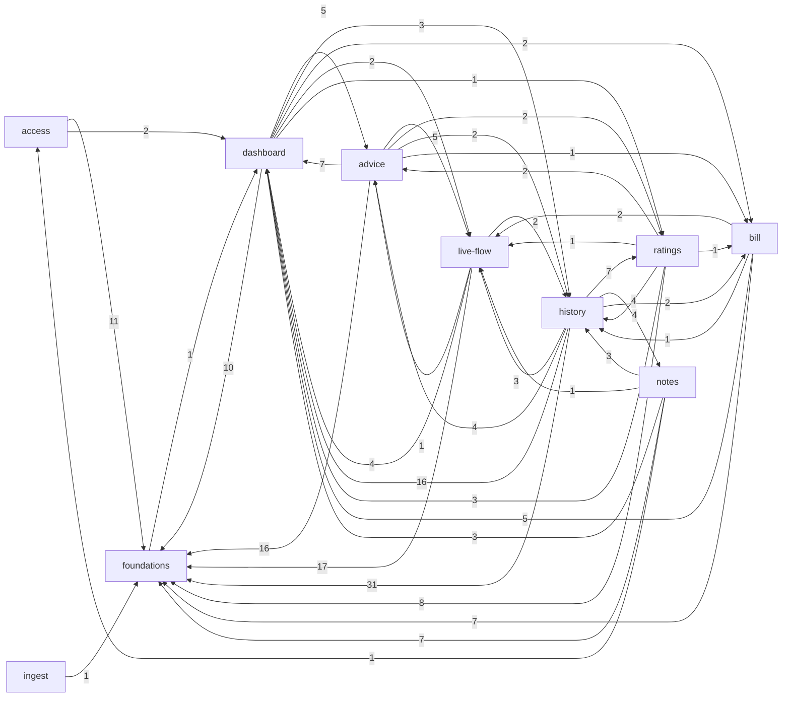
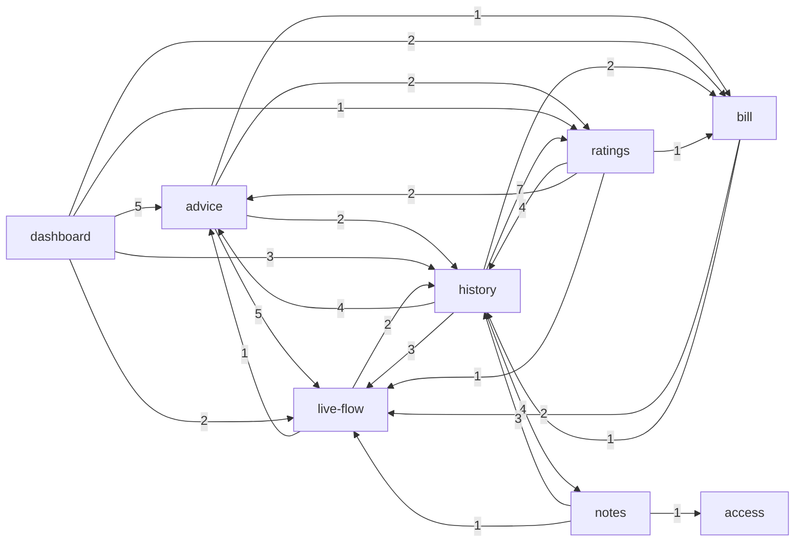

# Evidence: structure

Scope: tracked files of /dev-hub/projects/energy-analyser at head e334854. All numbers come from commands in this session (list at the end); attribution via `.work/capabilities.tsv`.

## Graph sources

| Language                                     | Source                                                                                                                                                                                                                                             | Level                 | Confidence  | Coverage / blind spots                                                                                                                                                                                                                                                                                                                                                                             |
| -------------------------------------------- | -------------------------------------------------------------------------------------------------------------------------------------------------------------------------------------------------------------------------------------------------- | --------------------- | ----------- | -------------------------------------------------------------------------------------------------------------------------------------------------------------------------------------------------------------------------------------------------------------------------------------------------------------------------------------------------------------------------------------------------- |
| TypeScript (.ts/.tsx)                        | own script `.work/extract-edges.mjs` using the TypeScript compiler API from the project's installed `node_modules/typescript` (parses real import/export-from/`import()` nodes, resolves relative paths and the `@/*` alias from tsconfig by hand) | 2 (project toolchain) | medium-high | 174 files parsed in total (src, scripts, tests, configs; 39 of them .astro). `import type` and all-inline-`type` specifiers tagged `type`. No re-export barrel resolution beyond the direct `export ... from` edge. Dynamic `import()` with literal paths: 5, all in `*.load.test.ts` and unresolved there (`./warsaw-time` etc. without extension, resolver misses them: 5 test-only edges lost). |
| Astro (.astro)                               | same script: frontmatter between `---` and `<script>` blocks extracted, parsed as TypeScript. YES, Astro files were parsed for imports: 39 .astro files, 213 import statements found.                                                              | 2                     | medium      | Template-level usage (components referenced without import, slots, `Astro.glob`, `import.meta.glob`) not seen; CSS import `src/layouts/Layout.astro -> ../styles/global.css` unresolved on purpose (1).                                                                                                                                                                                            |
| SQL (supabase/migrations, 12 files)          | none: SQL has no import graph                                                                                                                                                                                                                      | none                  | unknown     | Cross-capability coupling through tables, views and the `ingest_push` function is not in the graph. Partial substitute: `.from("<table>")` / `.rpc()` call sites in src (`.work/db-access-ts.txt`, grep-level, 12 sites).                                                                                                                                                                          |
| Bash (.claude/hooks, .husky), YAML (.github) | none                                                                                                                                                                                                                                               | none                  | unknown     | Workflows run `npm` scripts; not graphed.                                                                                                                                                                                                                                                                                                                                                          |
| scripts/*.mjs (3), config .mjs/.ts           | included in the script's file list                                                                                                                                                                                                                 | 2                     | medium      | 0 edges from scripts or configs into src (verified: no `scripts/`, `astro.config`, `vitest*`, `stryker*` rows in the edge list). `contract:export` is just `vitest run src/lib/ingest/contract.test.ts` with an env flag.                                                                                                                                                                          |

Dedicated tools: madge, dependency-cruiser, skott not in `node_modules/.bin` and no config in repo (checked); `tsc` and `astro` binaries exist but no project graph rules. Edges: 342 file-level (non-test) = 290 runtime + 52 type, 0 build. Test-to-src edges: 109 (kept separate in `.work/edges-tests-to-src.csv`; tests excluded from the capability graph). Mapped files: 0 unmapped nodes among all graphed files (evidence).

## Capability graph

Runtime edges, 42 capability pairs. Ca/Ce are counted on capability nodes (distinct neighbours), instability = Ce/(Ca+Ce), from `graph-metrics.mjs`:

| Capability  |  Ca |  Ce | Instability |
| ----------- | --: | --: | ----------: |
| foundations |   9 |   1 |        0.10 |
| live-flow   |   6 |   4 |        0.40 |
| dashboard   |   8 |   6 |        0.43 |
| bill        |   4 |   4 |        0.50 |
| history     |   6 |   7 |        0.54 |
| advice      |   4 |   6 |        0.60 |
| access      |   1 |   2 |        0.67 |
| ratings     |   3 |   6 |        0.67 |
| notes       |   1 |   5 |        0.83 |
| ingest      |   0 |   1 |        1.00 |

`platform` and `docs` have no source files in the graph (platform: 0 runtime edges; docs: prose). Edge labels = number of file-level runtime import edges.

Full graph (all runtime edges, computed from `.work/cap-edges-detail.tsv`):

Trimmed (edges into `foundations` and into `dashboard` removed because both hold shared presentational helpers, see Centres):

Note: the SQL/DB path (ingest writes `daily_energy`, `recommendations`, `hourly_energy`; live-flow, history, advice, bill read them) is NOT drawn because it is not in the import graph.

## Blast radius per capability

All claims `evidence` unless marked.

- **ingest (high)**: incoming runtime edges 0 (evidence). Outgoing: `src/pages/api/ingest.ts` -> `src/lib/services/ingest.ts` -> `src/lib/ingest/contract.ts`, plus `src/lib/supabase.ts` (foundations); 1 edge to foundations. Nothing in src imports the contract except its own service and tests (the endpoint is hit over HTTP). Real fan-out goes through SQL: `ingest_push` writes tables that live-flow (`daily_energy`, `live_state`), history (`daily_energy`, `hourly_energy`, `recommendations`, `day_notes`), advice (`recommendations`, `daily_energy`), bill (`bill_forecast`) and ratings (`period_summaries`) read (db-access-ts.txt). That is blast radius the import graph cannot show: `inference` = a payload/contract/function change reaches 5 read capabilities. Tests: `tests/integration` import ingest and 5 other capabilities (push-to-page: ingest -> advice 3, bill 2, history 3, live-flow 3, ratings 1 test import edges). External consumers: the home lab pushes to `/api/ingest` with `docs/ingest/contract-v1.schema.json`; consumer code is in another repo = `unknown (external)`.
- **access (high)**: incoming 1 (notes: `src/pages/api/notes.ts` imports the `SIGNIN_PATH` constant from `src/lib/services/magic-link.ts`, evidence). Outgoing 2: foundations (11 file edges, mostly `utils`/`supabase`/`logger`) and dashboard (`Layout.astro` x2). `src/middleware.ts` imports only logger, request-id, supabase, auth-outage (all low-level); it does not import route guards or owner logic: owner-only enforcement lives in SQL (`app_owners` migrations), invisible to the graph (`unknown`). File-level: `password-signin.ts` -> `magic-link.ts`.
- **live-flow (high)**: incoming from 6 capabilities (dashboard, bill, history, advice, notes, ratings). The widely imported file is `src/lib/services/grid-sensor.ts` (Ca 8, importers in bill, history, notes, ratings) and `src/components/live/VerdictChip.tsx` (imported by advice). Outgoing: foundations 17, dashboard 4, history 2 (`grid-sensor.ts` -> `src/lib/calendar/period.ts`), advice 1 (`live-state.ts` -> `usage-insight.ts`, a service reaching into another capability's service).
- **bill (high)**: incoming 4 (dashboard 2, advice 1, history 2, ratings 1 via `complete-day.ts`). Outgoing: foundations 7, dashboard 5, live-flow 2 (`BillForecastCard.astro` -> `grid-sensor.ts`), history 1 (`bill-forecast.ts` -> `format/period.ts`).
- **advice (medium)**: incoming 4 (dashboard 5, history 4, live-flow 1, ratings 2). Outgoing 6 including live-flow 5 (`VerdictChip` and friends), ratings 2, bill 1, history 2.
- **history (medium)**: widest fan-out: Ce 7 capabilities; incoming 6 (dashboard, bill, live-flow, advice, ratings, notes). `src/pages/dashboard/history.astro` imports 20 files (Ce 20, highest in repo), `DayView.astro` 13, `MonthView.astro` 12, `calendar-view.ts` 11 and Ca 6. Shared contract: `src/lib/calendar/period.ts` (Ca 8) and `src/lib/format/period.ts`.
- **ratings (medium)**: Ce 6, incoming 3 (history 7 file edges, dashboard 1, advice 2). `period-rating.ts` imports from history, advice, bill and live-flow services (Ce 9 files).
- **notes (medium)**: incoming 1 (history 4 edges: `DayView.astro` -> `DayNotePanel.astro`); outgoing 5 (history 3, live-flow 1, access 1, plus foundations and dashboard). Data coupling: `history/calendar-data.ts` queries `day_notes` directly (evidence), bypassing `day-notes.ts` (inference: a schema change to `day_notes` hits history too).
- **dashboard (medium)**: incoming 8, outgoing 6: composes advice 5, history 3, bill 2, live-flow 2, ratings 1. Also hosts shared UI (`CardHeading.astro` Ca 13, `StatusBadge.astro` Ca 15, `Layout.astro`), see Centres.
- **foundations**: incoming 9 capabilities; one reverse edge (below).

## Cycles

- File-level runtime graph: strongly connected components with more than 1 file = **0** (evidence; also 0 when type edges are added). No file loop.
- Capability-level graph: one 9-node cycle (access, advice, bill, dashboard, foundations, history, live-flow, notes, ratings) reported by `graph-metrics.mjs`. It is a product of folding, not a code loop (rule: the smallest real loop is none). Smallest capability-level 2-cycles by edge pairs (evidence in the detail table): dashboard<->advice, dashboard<->bill, dashboard<->history, dashboard<->live-flow, dashboard<->ratings, advice<->history, advice<->live-flow, history<->live-flow, history<->ratings, history<->notes, live-flow<->bill, advice<->bill (bill->advice is type-only, so not a runtime 2-cycle). All run through composition components (a card imports `CardHeading`/`Layout` in dashboard, `DashboardBody` imports the cards) or `period.ts` helpers, and file-level they are layered, not circular.
- Type-only cycle at capability level: foundations <-> dashboard/live-flow via `src/components/hooks/usePreference.ts` -> `src/lib/preferences.ts` (also runtime, 1 edge) and `useFlowLines.ts` -> `src/lib/flow-geometry.ts` (type). Mechanical (rule 9).

## Broken boundaries

Intended layering `inference`: foundations (types, format, ui, supabase, logger) -> services/lib (per capability) -> components -> pages (dashboard, history, api, auth).

1. foundations -> dashboard: `src/components/hooks/usePreference.ts` imports `src/lib/preferences.ts` (preferences is mapped to `dashboard`). The only upward edge from the base layer; 1 file edge runtime plus 1 type, plus `useFlowLines.ts` -> `src/lib/flow-geometry.ts` (type, live-flow). `inference`: hooks belong with their owners, or `preferences.ts` is a foundation.
2. Service-to-service reach across capabilities (lib layer, not just composition): `live-flow/live-state.ts` -> `advice/usage-insight.ts`; `ratings/period-rating.ts` -> `advice/usage-insight.ts`, `bill/complete-day.ts`, `live-flow/grid-sensor.ts`, `history/calendar/period.ts`; `advice/usage-insight.ts` -> `history/format/period.ts`; `bill/bill-forecast.ts` -> `history/format/period.ts`; `live-flow/grid-sensor.ts` -> `history/calendar/period.ts`; `notes` api -> `access` (`SIGNIN_PATH`). Many cross edges are helpers (`period.ts`, `grid-sensor.ts`) that `capabilities.tsv` places inside history/live-flow but behave as shared time/sensor helpers (attribution issue, `inference`).
3. Cards reaching into other capabilities' components: advice -> live-flow `VerdictChip`, advice -> bill `RecommendationForecast`, history -> bill `RecommendationForecast`, history -> advice `AdviceBlocks`. Composition, low risk.
4. Data-layer bypass: `history/calendar-data.ts` reads `day_notes`, `recommendations`; `live-flow/live-state.ts` and `advice/usage-insight.ts` read `daily_energy`. Table ownership is unclear: three capabilities read `daily_energy` directly (evidence, db-access-ts.txt).
5. ingest has Ca 0 and only 1 edge to foundations: the boundary between ingest and the read side is the DB schema, not code. Whether the in-repo contract and the SQL function stay in sync is checked only by hand/tests: `unknown` (see Mechanical).

## Test risks

Tests are excluded from the graph; edge counts below are test -> src import edges (`.work/edges-tests-to-src.csv`, 109 edges).

- Pure, cheap to unit test (few imports, mostly foundations): foundations (13 intra edges tested), live-flow services, bill-forecast, history calendar logic: tests import the capability's own files plus foundations.
- Hard in isolation: `history` pages (`history.astro` Ce 20, `calendar-view.ts` Ce 11), `ratings/period-rating.ts` (Ce 9 across four capabilities), `dashboard.astro` (Ce 11): need integration or e2e; heavy mocking of services and Supabase would be fragile.
- ingest and access: logic lives in SQL (`ingest_push`, owner read RLS); unit tests with mocked clients cannot cover it; only `tests/integration` (real local Supabase) does; integration tests import 6 capabilities' services (ingest->advice/bill/history/live-flow/ratings). inference: e2e (browser) for sign-in, integration for ingest.
- Supabase client (`src/lib/supabase.ts`, Ca 8, 7 more for `query-error.ts`): global data client, every loader needs it mocked or a live stack.
- Files imported by at least one test, per capability (non-test files / tested): foundations 11/21, history 8/17, live-flow 5/10, access 4/16, advice 3/9, dashboard 2/15, ingest 2/3, bill 2/4, ratings 2/5, notes 1/5. This is import reachability, not coverage (`unknown` for line coverage; evidence only that these files are imported by a test).

## Centres and thin entry points

- Load-bearing contracts (high Ca, low instability): `src/lib/utils.ts` Ca 20, `format/warsaw-time.ts` Ca 16, `ui/Panel.astro` Ca 15, `format/status.ts` Ca 14, `format/values.ts` Ca 12, `lib/supabase.ts` Ca 8, `query-error.ts` Ca 7 (all foundations, Ce 0..1). Time (Warsaw) and value formatting underlie money/boundary logic: change radius is repo-wide. Rule 2: partly fan-in by design (a `cn()`/`Panel` primitive), cheap if a typecheck catches signature breaks.
- Shared presentation inside `dashboard`: `StatusBadge.astro` Ca 15, `CardHeading.astro` Ca 13, `TermsExplained.astro` Ca 5. They inflate dashboard Ca and every `x->dashboard` edge: mapping artifact, not a dependency on the dashboard page (`inference`).
- Cross-capability helper contracts: `live-flow/grid-sensor.ts` Ca 8, `history/calendar/period.ts` Ca 8. Candidates for foundations.
- Thin entry points: `src/pages/api/ingest.ts` (3 imports: service, supabase, via contract), `src/middleware.ts` (4 low-level imports), `src/pages/api/notes.ts`. Those delegate; the core is `services/ingest.ts` + the `ingest_push` SQL function (the SQL half is `unknown` to the graph). Largest composers: `history.astro` (Ce 20), `dashboard.astro` (Ce 11), `DashboardBody.astro` (Ce 8): the orchestration layer, not the core.

## Mechanical signals

- Type-only edges: 52 of 342 (15%), kept out of the runtime graph. Top: `x -> foundations` 4+3+7+5+3+1 (types.ts), dashboard->advice/bill/history/live-flow/ratings 1-2 each (props types for `DashboardBody`).
- Build edges: 0. Config-as-code: no config or script files import src.
- `docs/ingest/contract-v1.schema.json` is generated from `src/lib/ingest/contract.ts`: `contract:export` = `UPDATE_INGEST_CONTRACT=1 vitest run src/lib/ingest/contract.test.ts` (package.json), and CLAUDE.md states `npm test` fails if the schema drifts; only `contract.test.ts` references it in src. Mechanical, guarded.
- SQL migrations vs TS types: coupled by hand. No generator found (no `supabase gen types` in package.json, `grep` of package.json empty; `src/types.ts` is hand-maintained) and no import edge; the only tie is the table/view names in `.from()` calls. Treat a migration + `types.ts` lockstep as unguarded unless the integration suite catches it (`unknown`). 12 migrations in 2 weeks, 9 in-place renames (scan contract).
- Dashboard shared-presentation fan-in (StatusBadge, CardHeading) = rule 2 style fan-in by design.
- `foundations -> dashboard` via hooks is attributable to path mapping (hooks in `src/components/hooks` mapped to foundations).

## Unknowns

- SQL/DB coupling (tables, views, RLS, `ingest_push`) is not graphed: no cross-capability database blast radius, no migration-to-code mapping. Tool worth installing for SQL: none standard; schema diff via `supabase db diff` or a pgTAP/integration suite.
- JS/TS: install `dependency-cruiser` (with tsconfig paths + `.astro` handled via a custom resolver) or `skott`/`madge` to cross-check this hand-built graph; neither parses Astro templates natively, so a level-3 tool would need the same extractor for `.astro`. Confidence stays medium.
- Runtime coupling: Astro middleware order, `Astro.locals`, env-driven behavior (`ALLOW_SIGNUP`, `APP_ORIGIN`), `import.meta.glob` (not searched), template-level component use without imports: `unknown`.
- External consumers of `/api/ingest` and the contract schema (home lab repo): `unknown (external)`.
- Owner-only enforcement (`app_owners`, RLS, column grants) is in SQL; whether any page reads without it cannot be seen here.
- 5 dynamic `import()` calls in `*.load.test.ts` not resolved (test-only; no effect on the capability graph).
- Attribution caveat: helper files placed in a feature capability by `capabilities.tsv` (grid-sensor, calendar/period, preferences, CardHeading, StatusBadge) create the apparent cross edges and the 9-node capability cycle.

## Commands run

- `node context/map/.work/extract-edges.mjs` (TypeScript compiler API; writes `edges-typescript.csv`, `edges-typescript-with-tests.csv`, `edges-tests-to-src.csv`, `edges-unresolved.txt`, `edges-dynamic.txt`)
- `node .../graph-metrics.mjs edges-typescript.csv --modules capabilities.tsv --kind runtime` (and `--emit mermaid`), output in `metrics-runtime.md`, `cap-graph-runtime.mmd`
- `python3 .work/fold.py edges-typescript.csv` -> `cap-edges-detail.tsv`; inline python for Tarjan SCC (file level), Ca/Ce top lists, test-to-src fold, `.from()/.rpc()` scan -> `db-access-ts.txt`; `command grep` on edge CSVs, package.json, scripts.
