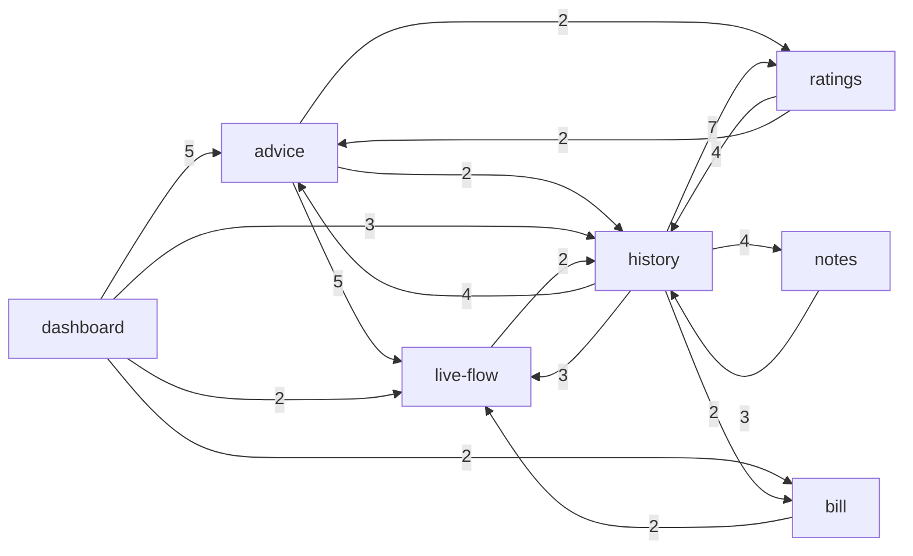

# Project map: energy-analyser

## 1. TL;DR

energy-analyser is a small SSR web app (Astro + React + Supabase) that shows one household's energy use. A home lab pushes data to it; the owner signs in and reads a dashboard with the live power flow, a daily recommendation, a bill forecast, and a history calendar with period ratings and day notes. Since the last map it also lets the owner set **alert rules** that a cron-driven evaluator checks and sends to Telegram. The main capabilities are **push ingestion**, **sign-in and owner access**, **live flow**, **bill forecast**, **daily advice**, **history**, **ratings**, **notes**, **alerts** and the **dashboard** that composes them. The whole history is 3.5 weeks and one person, so every concentration is a baseline and "rising" mostly means "built that week".

Where the buzz is: most product capabilities peaked in W40 (a feature campaign), and 87% of commits touch planning prose. Fix share is a flat 19-30% everywhere and mostly planned review-fix rounds (22 of 40 fix commits), so it does not separate capabilities. Where it hurts: the **push boundary** (the ingest contract, the service and the SQL functions; reach goes through the database, which no import graph covers), **live flow** (imported by seven capabilities), **sign-in and owner access** (the only capability with real behaviour defects, enforcement in SQL), the **time and value helpers** every money and boundary decision rests on, and a new one: the **unattended alert evaluator**, which reads the bill and live-state loaders from cron with no page view to show a break.

Runtime import edges between capabilities, weight 2 or more, edges into `foundations` and `dashboard` removed (see `evidence/3-structure.md`). `ingest`, `access` and `alerts` drop out because all their remaining edges are weight 1 or go into foundations or dashboard; `alerts` has 19 outgoing edges and one incoming (`DashboardHeader.astro` to `alert-rules.ts`). `ingest` has one importer (`history` via `hourly-usage.ts` to `ingest/retention.ts`, new); its real reach goes through the database (section 3).

## 2. Terrain

Buzz families: **chg** = change, **fix** = fix pressure, **fric** = friction, **attn** = attention (planning artefacts), **reach** = blast radius. H/M/L are relative to the other capabilities. The trend column is weak throughout: 3.5 weeks, one author. Percentages are shares of the 845 code and config file changes (docs excluded).

| Capability    | What it does                                                                                           | Criticality (criteria)                                            | chg        | fix                                           | fric                                  | attn                                  | reach                                          | Trend                          | Where it lives                                                                                                                                                             |
| ------------- | ------------------------------------------------------------------------------------------------------ | ----------------------------------------------------------------- | ---------- | --------------------------------------------- | ------------------------------------- | ------------------------------------- | ---------------------------------------------- | ------------------------------ | -------------------------------------------------------------------------------------------------------------------------------------------------------------------------- |
| **ingest**    | Home lab pushes live state, history, recommendations and bill facts to `POST /api/ingest`              | high (core value, public bearer-token endpoint, writes user data) | M (11.1%)  | M (25%, mostly review fixes)                  | M (2 pinned boundary gaps, 5 earlier) | H (6 plans, 1 in flight and stale)    | H via SQL (inference)                          | built W39-W40, refactored W41  | `src/pages/api/ingest.ts`, `src/lib/services/ingest.ts`, `src/lib/ingest/`, `supabase/migrations/*push_ingestion*`, `*ingest_push_sections*`, `*ingest_token_ok*`          |
| **access**    | Magic-link and password sign-in, session middleware, Origin check, owner-only reads                    | high (identity and access, unauthenticated entry points)          | L-M (8.8%) | M (5 real defects, the only non-review fixes) | M (4 fixes in 10 days, early)         | M (3 plans, 1 in flight)              | L in imports, SQL RLS unknown                  | fading, then access tests W41  | `src/middleware.ts`, `src/pages/auth`, `src/pages/api/auth`, `src/lib/services/magic-link.ts`, `*owner_read*` migrations                                                   |
| **live-flow** | Current power flow (PV, battery, grid, load), verdict chips, staleness                                 | high (core value, seven capabilities depend on it)                | M (8.9%)   | M (22%)                                       | M (stale-row defect, giant PR #57)    | H (5 plans)                           | H (7 importers)                                | rising, then flat              | `src/lib/services/live-state.ts`, `grid-sensor.ts`, `src/components/live/`, `LiveStateCard.astro`                                                                          |
| **bill**      | Forecasts the electricity bill and judges it against the invoice                                       | high (money)                                                      | M (6.5%)   | L (19%)                                       | M (3 fixes in 2 days, real defects)   | M (2 plans)                           | M (5 importers incl. alerts)                   | new in W40                     | `src/lib/services/bill-forecast.ts`, `complete-day.ts`, `BillForecastCard.astro`                                                                                           |
| **advice**    | Daily recommendation, findings, seasonal usage comparison                                              | medium (core value, LLM text)                                     | M (10.2%)  | M (30%, mostly review fixes)                  | L                                     | M (5 plans)                           | M                                              | rising, then flat              | `src/lib/services/recommendation.ts`, `usage-insight.ts`, `RecommendationCard.astro`                                                                                       |
| **history**   | Day, month and quarter views, navigation, hourly usage, Warsaw-time boundaries                         | medium (core value, boundary logic)                               | M (10.2%)  | M (26%)                                       | M (suspect-hours fix)                 | H (5 plans)                           | H (8 outgoing, 20-import page)                 | rising, then flat              | `src/pages/dashboard/history.astro`, `src/lib/services/calendar-view.ts`, `src/lib/calendar/`, `src/components/history/`                                                   |
| **ratings**   | Rates a period; shows the lab's period summaries as text                                               | medium (LLM text, markup safety)                                  | L (3.1%)   | M (29%, small n)                              | M (change-month bug)                  | L-M (2 plans plus 1 shared in flight) | M (`period-rating.ts` spans four capabilities) | new in W40                     | `src/lib/services/period-rating.ts`, `period-summary.ts`                                                                                                                   |
| **notes**     | Owner adds a short note to a day                                                                       | medium (user data written)                                        | L (2.2%)   | L-M (25%, n=2)                                | M (5 pinned gaps, small footprint)    | L (1 plan)                            | L                                              | new in W40                     | `src/lib/services/day-notes.ts`, `src/pages/api/notes.ts`                                                                                                                  |
| **dashboard** | Composes the dashboard page, layout, banners, status badge                                             | medium (front door, composer)                                     | M (6.3%)   | M (25%, spillover)                            | L                                     | M (4 plans, restyles)                 | M-H (composer, partly a mapping artefact)      | rising, then flat              | `src/pages/dashboard.astro`, `DashboardBody.astro`, `src/layouts/`                                                                                                         |
| **alerts**    | Owner-managed alert rules (stale live data, bill above a limit), evaluated from cron, sent to Telegram | medium (user data written, unattended path, outbound message)     | M (5.7%)   | n/a (2 of 5 commits, both review rounds)      | M (2 P1 and 5 P2 in a day)            | H (2 plans, both in flight)           | L in imports (1 importer), H in SQL copies     | new in W41, one day of history | `src/pages/api/alert-rules.ts`, `api/alerts/evaluate.ts`, `src/lib/services/alert-*.ts`, `telegram.ts`, `src/components/alerts/`, `*alert_rules*` migrations, `tests/e2e/` |

Short lines for the rest:

- **Platform and infrastructure** (high by what it can break: CI, ruleset gating `main`, image publishing, manual production deploy, hooks, smoke test, now the e2e job): 15.3% of code changes, 29% fix share, all CI, deploy and e2e wiring iteration. See "Looks hot, is not".
- **Shared foundations** (high by dependants: format helpers, UI primitives, logger, Supabase client, types, styles): 10.4% of changes, but 29 of its 54 commits are cross-cutting. Capability fan-in 10, 117 file edges in.
- **Docs and planning** (prose, never ranked): 52% of file changes and 87% of commits. Planning trail: 33 archived change folders plus 4 in flight under `context/changes/`.

Coverage: unmapped 1.4% of code changes (12 changes, all in files deleted before HEAD). Platform plus foundations are 25.7% of code changes (below the 40% limit). A first pass of this refresh left the push-boundary files unmapped; the attribution file was fixed and every table here uses the corrected counts.

Folder structure versus capabilities: a capability spans many folders. For example ingest crosses `src/pages/api`, `src/lib/services`, `src/lib/ingest`, `docs/ingest`, `scripts/` and `supabase/migrations`; alerts crosses the same layers plus `tests/e2e`, a compose service and a GitHub workflow. In the other direction, `src/lib/services/` and `src/lib/format/` serve several capabilities each. Helpers placed in a feature capability behave as shared ones (`grid-sensor.ts`, `calendar/period.ts`, `preferences.ts`, `CardHeading.astro`, `StatusBadge.astro`); these create most of the apparent cross edges.

## 3. Real couplings

| Coupling                                                                                                                                                                                                          | How we know                                                                                                                                                                              | Mechanical?                                                                                         |
| ----------------------------------------------------------------------------------------------------------------------------------------------------------------------------------------------------------------- | ---------------------------------------------------------------------------------------------------------------------------------------------------------------------------------------- | --------------------------------------------------------------------------------------------------- |
| **ingest → live-flow, history, advice, bill, ratings, alerts**, through tables and views (`daily_energy`, `hourly_energy`, `recommendations`, `live_state`, `bill_forecast`, `period_summaries`, `ingest_pushes`) | `.from()` / `.rpc()` call sites in `src` (27 sites, grep-level), integration tests; SQL has no graph                                                                                     | no; inference, since the import graph shows ingest with one importer                                |
| **ingest contract ↔ `docs/ingest/contract-v1.schema.json`**                                                                                                                                                       | changed together; `contract:export` regenerates it and `npm test` fails on drift                                                                                                         | **yes**, generated and guarded                                                                      |
| **ingest contract ↔ SQL `ingest_push` and its section helpers**                                                                                                                                                   | hand-kept twin; `ingest_push` was redefined 6 times across migrations, now split into `ingest.store_*`; the contract is enforced by the route, not by the function (2 pinned KNOWN GAPs) | no; guarded by the golden-replay and boundary integration tests, overlap with contract not measured |
| **token hash check in `ingest_push` ↔ `ingest_token_ok`**                                                                                                                                                         | same check in two SQL functions (migrations `20261006120000`, `20261006130000`)                                                                                                          | no; a drift test is not known                                                                       |
| **`alerts_snapshot` ↔ the `live_state` and `bill_forecast` views**                                                                                                                                                | the alert SQL copies the views' filters straight onto `ingest_pushes` (`20261007090000_alert_rules.sql`)                                                                                 | no; a change to either view can silently change what alerts see                                     |
| **alert limits in SQL ↔ TypeScript** (`live_stale` 15..1440, `bill_above` 1..7000)                                                                                                                                | mirrored by hand in migration and `alert-rules.ts`; no test found that ties them                                                                                                         | no; `unknown` whether a test catches drift                                                          |
| **migrations ↔ `src/types.ts`**                                                                                                                                                                                   | hand-maintained, no generator found, no import edge                                                                                                                                      | no; unguarded, `unknown` whether the suite catches drift                                            |
| **live-flow → seven capabilities** (`grid-sensor.ts`, `live-state.ts` are the hubs)                                                                                                                               | runtime graph                                                                                                                                                                            | no                                                                                                  |
| **alert-evaluation → bill-forecast and live-state** (service-to-service reach), and **alerts → access** (`alert-rules.ts` imports `SIGNIN_PATH` from `magic-link.ts`)                                             | runtime graph                                                                                                                                                                            | no; a bill or live-state loader change breaks the cron path with no page view                       |
| **history ↔ ratings ↔ advice ↔ bill** services reach into each other (`period-rating.ts` imports advice, bill, live-flow and history files)                                                                       | runtime graph                                                                                                                                                                            | no                                                                                                  |
| **history → ingest** (`hourly-usage.ts` imports `ingest/retention.ts`)                                                                                                                                            | runtime graph, new since the refactor                                                                                                                                                    | no; the only import into ingest, which puts ingest into the capability-level cycle                  |
| **history reads `day_notes` directly**, bypassing `day-notes.ts`; three capabilities read `daily_energy` directly                                                                                                 | call sites                                                                                                                                                                               | no; table ownership unclear                                                                         |
| **cards ↔ foundations ↔ `dashboard.astro`** (advice–foundations 18 shared commits, confidence 0.49; foundations–live-flow 15; advice–dashboard 12)                                                                | co-change                                                                                                                                                                                | partly: shared cause is one feature campaign, the page is a true composition point                  |
| **smoke test ↔ everything** (`scripts/smoke.mjs`: 11 partner capabilities, 21 commits; alerts is the newest)                                                                                                      | co-change                                                                                                                                                                                | **yes**, workflow lockstep guarded by the required `smoke` job                                      |
| **access ↔ platform** (11 shared commits, confidence 0.52, the highest)                                                                                                                                           | co-change                                                                                                                                                                                | partly: CI and deploy work for the auth flow, not a hidden dependency                               |
| **history ↔ notes** (5 of 8 notes commits)                                                                                                                                                                        | co-change                                                                                                                                                                                | structural: the notes UI lives under `components/history`                                           |
| **foundations → dashboard** (`usePreference.ts` imports `preferences.ts`)                                                                                                                                         | runtime graph                                                                                                                                                                            | the only upward edge from the base layer; a path-mapping artefact                                   |

No real file-level cycle exists (0 file-level components). At capability level one folded cycle spans all 11 nodes and 14 runtime 2-cycles exist, new among them `alerts ↔ dashboard`; both come from folding files into capabilities, because cards import shared presentation pieces and the dashboard imports every card. The alerts feature commit (`2a9e7d7`) is the only commit that couples alerts to access, bill, dashboard and foundations, and the co-change rule drops it (7 capability ids); after it alerts changes with platform and docs only. Consumers of the ingest contract and the alert trigger in the home-lab repo are `unknown (external)`.

## 4. Risk zones

A risk zone is high criticality with high buzz in at least two independent families, or medium criticality with high buzz in three. Mechanical signals are excluded.

**1. The push boundary (contract, service and `ingest_push`)**

- Why: every data page and the alert evaluator depend on what this boundary accepts, and the dependency is invisible in imports. The refactor (#131) made it better structured and kept a deliberate gap: an out-of-contract payload sent straight to the RPC with a valid token is still stored.
- Independent signals: _reach_ (a payload or function change reaches five read capabilities plus alerts through SQL; inference); _friction and debt_ (2 KNOWN GAP lines in `ingest-boundary.test.ts`, 5 older store gaps pinned in the history-safety tests; earlier bot findings were an RPC rejection escaping the handler and `2026-02-31` accepted as a date); _attention_ (6 plans, `lab-period-summaries` in flight and stale since 10-01, `docs/ingest/README.md` in 17 commits).
- Open question the evidence raises: the squash is titled "phases 1-2 of 5" but contains both the section split and `ingest_token_ok`, and the change was archived the same day without an impl review file. Whether phases 3-5 happened inside it is not visible from history.
- Files: `src/pages/api/ingest.ts`, `src/lib/services/ingest.ts`, `src/lib/ingest/contract.ts`, `supabase/migrations/20260923101001_push_ingestion.sql`, `20261006120000_ingest_push_sections.sql`, `20261006130000_ingest_token_ok.sql`, `tests/integration/ingest-golden.test.ts`, `ingest-boundary.test.ts`.

**2. Live flow**

- Why: the most depended-on feature capability (seven importers, now including alerts), with the hottest card file.
- Independent signals: _reach_ (seven importing capabilities; `grid-sensor.ts` and `live-state.ts` are the hubs); _change_ (`LiveStateCard.astro` 14 commits, `live-state.ts` 12); _friction_ (a consumption verdict was rated from a stale daily row and needed a new migration; PR #57 is +9418 lines across 121 files, stacked on other changes).
- Files: `src/lib/services/live-state.ts`, `src/lib/services/grid-sensor.ts`, `src/components/LiveStateCard.astro`, `src/components/live/LiveFlow.tsx`.

**3. Sign-in and owner access**

- Why: it is the identity gate, and the only capability whose fixes are real behaviour defects instead of review rounds.
- Independent signals: _fix and friction_ (counted once: 5 non-review fixes, a password sign-in regression, double submit, CSRF origin behind the proxy; four fixes in ten days); _attention_ (3 plans, `observability-capture-layer` in flight with row 5.4 deliberately open, 3 pinned gaps). The defects are early (W38-W39); the access tests (#118) and the access-abuse tests in the refactor came after.
- Unknown that matters: owner-only enforcement lives in SQL (`app_owners`, RLS, column grants), invisible to the import graph. The alert tables add their own owner policies (`alert_rules`, `alert_tokens`) on the same unverified footing.
- Files: `src/middleware.ts`, `src/lib/services/magic-link.ts`, `src/lib/services/password-signin.ts`, `src/pages/api/auth/`, `tests/integration/access-abuse.test.ts`.

**4. Time and value helpers (sub-area of foundations)**

- Why: Warsaw time and value formatting underlie money and boundary decisions; the change radius is repo-wide.
- Independent signals: _reach_ (`format/warsaw-time.ts` 16 importers, `format/values.ts` 12, `format/status.ts` 14); _change_ (7 commits each on `warsaw-time.ts` and `glossary.ts`, past boundary-guard fixes).
- Files: `src/lib/format/warsaw-time.ts`, `src/lib/calendar/period.ts`, `src/lib/format/values.ts`.

**5. The unattended alert evaluator (new)**

- Why: it runs from cron (`alerts-evaluate.yml` → `scripts/alerts-trigger.mjs` → `POST /api/alerts/evaluate`, a bearer-token route outside the Origin check) and reads the bill and live-state loaders. Nobody opens a page when it breaks, and delivery is unproven.
- Independent signals: _reach_ (calls into `bill-forecast.ts` and `live-state.ts`, copies view filters in SQL, mirrors limits by hand); _friction_ (2 P1 and 5 P2 Codex findings in one day, among them "fail the evaluation when Telegram delivery fails" and a race on the enabled-rule cap; impl review F9 token on the public VPS and F10 no hysteresis recorded and not fixed); _attention_ (2 plans in flight, `alert-rules` row 4.6, a manual run that produces an alarm and a recovery message, still unticked).
- Caveat: one day of history, 5 commits. This zone is scored on structure and review findings, not on trend.
- Files: `src/lib/services/alert-evaluation.ts`, `alerts-evaluate.ts`, `telegram.ts`, `src/pages/api/alerts/evaluate.ts`, `supabase/migrations/20261007090000_alert_rules.sql`, `20261007120000_alert_rules_review_fixes.sql`, `tests/integration/alerts-evaluate.test.ts`.

**Watch** (narrowly missed the bar):

- **Bill forecast**: criticality is high (money) and real defects were caught by review (central estimate outside its range, `generated_at` in the future, three fix commits in two days), but volume is small, the capability is two weeks old and its fix share is the lowest (19%). Reach grew to five importers.
- **History**: medium criticality with high reach (`history.astro` imports 20 files; the widest fan-out, 8 outgoing capabilities) and attention, but friction is medium; its 11 pinned gaps mostly describe ingest store semantics, so they are not counted here.
- **E2E layer**: Playwright (`tests/e2e`, 4 files, covers sign-in and the alert rules page only) has no import edges into `src`, the `e2e` job is not a required check, and the review found a database host guard that could be bypassed (fixed in #143); one follow-up (three hand-synchronised copies of the guard) is open.

**Looks hot, is not:**

- **Platform**: highest code-change share and 29% fix share, but the fixes are CI, deploy and e2e wiring iteration (Buildx, setup-node pin, IPv6 bind, Stryker cache, #139, #143). `scripts/smoke.mjs` as a hub is lockstep guarded by a required job.
- **Fix share everywhere**: 19-30% uniformly, 22 of 40 fix commits (55%) are planned "implementation review fixes (F1-Fn)" produced by the workflow's review step, not defects. There are zero reverts in the whole history. Alerts' two fix commits are exactly that gate.
- **Eleven closed-unmerged PRs** (#122-#128, #132, #133, #140, #141): deliberate break-proof throwaways, not friction.
- **Bot review volume** (Sourcery 98 reviews, Codex 60): automation, not human review; there is no human reviewer.
- **Docs** at 87% of commits: prose churn; the dashboard never changes without its docs.
- **Dashboard and advice co-change** with foundations: one feature campaign touching shared pieces, a shared cause.
- **Large PRs** #57, #68 and #137: stacked or bundled change sets, not single risky edits.
- **Generated files**: `contract-v1.schema.json` moves with `contract.ts` by regeneration.

## 5. Whom to ask

One human has made every commit: the repo owner, for every zone (271 human commits across the `Kamil Nowosad` and `titusandronicu` names, 7 `Mother Console`, 3 `Cursor Agent`). That is the team-size baseline, not a finding. Claude co-authored 256 of the 271 human commits (94.5%; the 15 without a trailer are docs-touching), so the agent wrote much of the text under the owner's direction. The better source is the written trail:

| Zone                   | Where the knowledge is                                                                                                                                                                                                                                    |
| ---------------------- | --------------------------------------------------------------------------------------------------------------------------------------------------------------------------------------------------------------------------------------------------------- |
| Push boundary          | `context/archive/2026-09-23-push-ingestion-endpoint/`, `2026-09-25-daily-history-push/`, `2026-10-01-testing-push-to-page-integration/`, `2026-10-06-refactor-push-boundary/`, `docs/ingest/README.md`, in-flight `context/changes/lab-period-summaries/` |
| Live flow              | `context/archive/2026-09-29-live-flow-interaction/`, `live-state-with-staleness`, `grid-export-mismatch`                                                                                                                                                  |
| Access                 | `context/archive/2026-09-23-access-key-sign-in/`, `2026-10-02-testing-access-and-input-abuse/`, in-flight `context/changes/observability-capture-layer/`, `context/audits/observability/`                                                                 |
| Time and value helpers | `context/archive/2026-10-01-testing-time-and-number-guards/`, `docs/logic.md`                                                                                                                                                                             |
| Alerts                 | in-flight `context/changes/alert-rules/` and `context/changes/e2e-alert-rules/` (both `impl_reviewed`, PRs merged, not yet archived), `docs/decisions.md` (2026-10-06 alert rules), `context/foundation/test-stack.md`                                    |
| Platform               | `docs/decisions.md`, the earliest deploy commits of 09-14..09-19 (author "Mother Console", unclear)                                                                                                                                                       |

If a second human appears, rerun this scan: every number about people changes.

## 6. First day

Read in this order; each is a path that exists at HEAD.

1. `docs/architecture.md`, then `docs/logic.md`: the idea, data flow and decision logic in prose.
2. `src/pages/api/ingest.ts` → `src/lib/services/ingest.ts` → `src/lib/ingest/contract.ts`, and the SQL half in `supabase/migrations/20261006120000_ingest_push_sections.sql`: how data gets in.
3. `src/middleware.ts` and `src/lib/services/magic-link.ts`: how a request becomes a signed-in owner.
4. `src/pages/dashboard.astro` → `src/components/DashboardBody.astro`: how the page composes the cards.
5. `src/lib/services/live-state.ts` with `src/lib/services/grid-sensor.ts`: the most shared feature logic.
6. `src/lib/format/warsaw-time.ts` and `src/lib/calendar/period.ts`: the time boundary every day-based decision uses.
7. `src/lib/services/bill-forecast.ts`: the money logic, with its test file beside it.
8. `src/lib/services/alert-evaluation.ts` and `src/pages/api/alerts/evaluate.ts`: the one path that runs without a page view.
9. `tests/integration/ingest-golden.test.ts`, `tests/e2e/alert-rules.spec.ts` and `scripts/smoke.mjs`: how the pieces are proven end to end.

## 7. Limitations

- **Window:** 3.5 weeks (2026-09-14..2026-10-07), the whole history, only about two weeks of real volume (W39, W40); W41 is three days. No trend label can be trusted; "rising" often means "built that week". The alerts capability has one day of history. Seasonal behaviour is not testable.
- **Sources:** git plus the GitHub CLI for all 124 PRs. PR attribution now uses each PR's changed files (all 124), so PR counts are larger than in the earlier title-based pass and not comparable with it. Bot-comment tags are matched by text.
- **Graph coverage:** TypeScript and Astro frontmatter only, medium confidence. SQL is covered by a hand-built table in `evidence/3-structure.md`, not a graph, and the older `db-access-ts.txt` is stale (12 sites then, 27 now). Not covered: Bash, YAML, template-level component use, middleware order, env-driven behaviour, `import.meta.glob`. Five test-only dynamic imports and one other import are unresolved. A level-3 tool (`dependency-cruiser` or `skott`) would cross-check the graph but neither parses Astro templates.
- **Capability coverage:** unmapped 1.4% of code changes; platform plus foundations 25.7%. Attribution is an inference from commit scopes, routes, tables and planning-folder names; it changed in this pass (alerts added, push-boundary files remapped to ingest).
- **People:** one human; the `titusandronicu` and Kamil Nowosad names are one person. "Mother Console" (7 commits) and "Cursor Agent" (3) are counted as activity, not people. Trailer counts are per commit, not per Co-Authored-By line (squash merges fold several).
- **No agent failed.** All four evidence agents completed. The first pass left six files unmapped; the main agent fixed the attribution file and recomputed the tables used here. `evidence/1-history.md` carries a note where its later prose predates that fix.
- **What the map does not say:** whether any fix corresponds to a production incident (no error tracker exists), whether alert delivery works (no Telegram evidence, row 4.6 open), line coverage, performance, security beyond what the history shows, or anything about the lab repo.
- **Unknowns worth a focused investigation:**
  1. Does `ingest_push` stay in sync with `src/lib/ingest/contract.ts`, and does anything check the duplicated token test in `ingest_token_ok`? Hand-kept twins, overlap not measured.
  2. Does anything read data without owner-only enforcement? Enforcement is in SQL and not visible here, now including the alert tables.
  3. Do migrations and the hand-maintained `src/types.ts` drift? No generator; unknown whether the integration suite catches it.
  4. Do the SQL and TypeScript alert limits stay equal, and do `alerts_snapshot` and the `live_state`/`bill_forecast` views stay equal?
  5. Server limits versus database limits for notes (`notes-parity` exists, co-change not measured) and Warsaw-time helpers versus SQL day boundaries.
  6. GitHub issues are stale against the archive (last update 2026-09-27; at least five open slice issues name features that shipped; none for alerts); progress may be tracked in Linear (FNK), which this scan did not read.
  7. The lab consumer of `/api/ingest` and the VPS alert trigger in homelab-2 are `unknown (external)`; contract drift on that side is invisible here.
  8. Observability audit fixes 4-9 (real readiness check, ingest rejection logging, lab heartbeat, auth message classification, startup config validation, log retention) still have no change folder: `/api/health` is still static.
  9. Why `refactor-push-boundary` is titled "phases 1-2 of 5", contains both migrations, and was archived with no impl review file.
  10. The dashboard shell has few test-file changes; its coverage rests on `scripts/smoke.mjs` (2 of 14 files tested by import).
