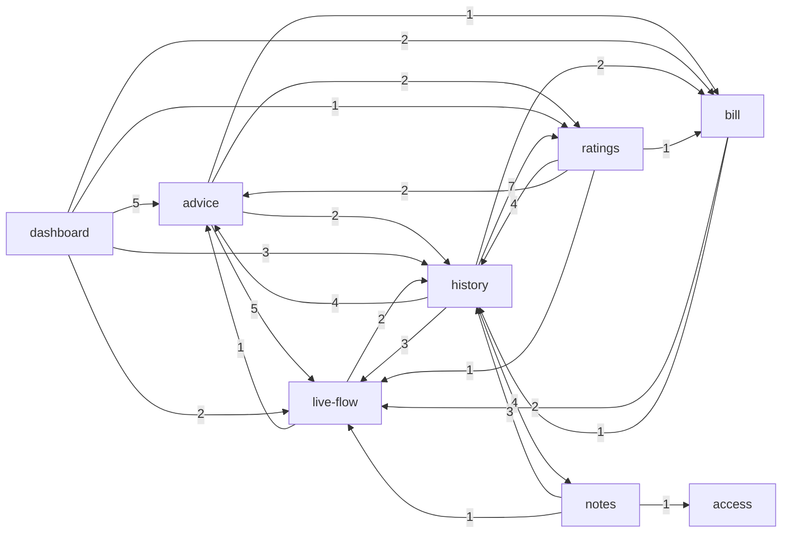

# Project map: energy-analyser

## 1. TL;DR

energy-analyser is a small SSR web app (Astro + React + Supabase) that shows one household's energy use. A home lab pushes data to it; the owner signs in and reads a dashboard with the live power flow, a daily recommendation, a bill forecast, and a history calendar with period ratings and day notes. The main capabilities are **push ingestion**, **sign-in and owner access**, **live flow**, **bill forecast**, **daily advice**, **history**, **ratings**, **notes** and the **dashboard** that composes them. The whole history is three weeks and one person, so every concentration is a baseline and "rising" mostly means "built that week".

Where the buzz is: most product capabilities peaked in the same week (W40, a feature campaign), and 87% of commits touch planning prose. Fix share is a flat 20-30% everywhere and is mostly planned review-fix rounds, so it does not separate capabilities. Where it hurts: the **ingest contract and its SQL function** (reach is through the database, which no graph here covers), **live flow** (imported by six capabilities), **access** (the only capability with real behaviour defects, enforcement in SQL) and the **time and value helpers** every money and boundary decision rests on.

Runtime import edges between capabilities, edges into `foundations` and `dashboard` removed (see `evidence/3-structure.md`). `ingest` is absent on purpose: nothing in `src` imports it. Its reach goes through the database (section 3).

## 2. Terrain

Buzz families: **chg** = change, **fix** = fix pressure, **fric** = friction, **attn** = attention (planning artefacts), **reach** = blast radius. H/M/L are relative to the other capabilities. The trend column is weak throughout: 3 weeks, one author.

| Capability    | What it does                                                                              | Criticality (criteria)                                            | chg        | fix                                           | fric                                | attn                     | reach                                          | Trend                         | Where it lives                                                                                                           |
| ------------- | ----------------------------------------------------------------------------------------- | ----------------------------------------------------------------- | ---------- | --------------------------------------------- | ----------------------------------- | ------------------------ | ---------------------------------------------- | ----------------------------- | ------------------------------------------------------------------------------------------------------------------------ |
| **ingest**    | Home lab pushes live state, history, recommendations and bill facts to `POST /api/ingest` | high (core value, public bearer-token endpoint, writes user data) | M (11.0%)  | M (26%, mostly review fixes)                  | M (5 pinned store gaps)             | H (5 plans, 1 in flight) | H via SQL (inference)                          | built W39-W40                 | `src/pages/api/ingest.ts`, `src/lib/services/ingest.ts`, `src/lib/ingest/`, `supabase/migrations/*push_ingestion*`       |
| **access**    | Magic-link and password sign-in, session middleware, Origin check, owner-only reads       | high (identity and access, unauthenticated entry points)          | L-M (8.9%) | M (5 real defects, the only non-review fixes) | M (4 fixes in 10 days, early)       | M (3 plans, 1 in flight) | L in imports, SQL RLS unknown                  | fading, then access tests W41 | `src/middleware.ts`, `src/pages/auth`, `src/pages/api/auth`, `src/lib/services/magic-link.ts`, `*owner_read*` migrations |
| **live-flow** | Current power flow (PV, battery, grid, load), verdict chips, staleness                    | high (core value, six capabilities depend on it)                  | H (10.0%)  | M (22%)                                       | M (stale-row defect, giant PR #57)  | H (5 plans)              | H (6 importers)                                | rising                        | `src/lib/services/live-state.ts`, `grid-sensor.ts`, `src/components/live/`, `LiveStateCard.astro`                        |
| **bill**      | Forecasts the electricity bill and judges it against the invoice                          | high (money)                                                      | M (7.0%)   | L (20%)                                       | M (3 fixes in 2 days, real defects) | M (2 plans)              | M (4 importers)                                | new in W40                    | `src/lib/services/bill-forecast.ts`, `complete-day.ts`, `BillForecastCard.astro`                                         |
| **advice**    | Daily recommendation, findings, seasonal usage comparison                                 | medium (core value, LLM text)                                     | H (11.4%)  | M (30%, mostly review fixes)                  | L                                   | M (4 plans)              | M                                              | rising                        | `src/lib/services/recommendation.ts`, `usage-insight.ts`, `RecommendationCard.astro`                                     |
| **history**   | Day, month and quarter views, navigation, hourly usage, Warsaw-time boundaries            | medium (core value, boundary logic)                               | H (11.3%)  | M (27%)                                       | M (suspect-hours fix)               | H (5 plans)              | H (7 outgoing, 20-import page)                 | rising                        | `src/pages/dashboard/history.astro`, `src/lib/services/calendar-view.ts`, `src/lib/calendar/`, `src/components/history/` |
| **ratings**   | Rates a period; shows the lab's period summaries as text                                  | medium (LLM text, markup safety)                                  | L (3.5%)   | M (small n)                                   | M (change-month bug)                | L-M                      | M (`period-rating.ts` spans four capabilities) | new in W40                    | `src/lib/services/period-rating.ts`, `period-summary.ts`                                                                 |
| **notes**     | Owner adds a short note to a day                                                          | medium (user data written)                                        | L (2.5%)   | L                                             | M (5 pinned gaps, small footprint)  | L (1 plan)               | L                                              | new in W40                    | `src/lib/services/day-notes.ts`, `src/pages/api/notes.ts`                                                                |
| **dashboard** | Composes the dashboard page, layout, banners, status badge                                | medium (front door, composer)                                     | M (6.8%)   | M (26%, spillover)                            | L                                   | M (4 plans, restyles)    | M-H (composer, partly a mapping artefact)      | rising                        | `src/pages/dashboard.astro`, `DashboardBody.astro`, `src/layouts/`                                                       |

Short lines for the rest:

- **Platform and infrastructure** (high by what it can break: CI, ruleset gating `main`, image publishing, manual production deploy, hooks, smoke test): 14.5% of code changes, 29% fix share, all CI and deploy iteration. See "Looks hot, is not".
- **Shared foundations** (high by dependants: format helpers, UI primitives, logger, Supabase client, types, styles): 11.6% of changes, but 28 of its 53 commits are cross-cutting. Fan-in: `utils.ts` 20 importers, `format/warsaw-time.ts` 16, `ui/Panel.astro` 15, `format/status.ts` 14, `lib/supabase.ts` 8.
- **Docs and planning** (prose, never ranked): 52% of file changes and 87% of commits. Planning trail: 32 archived change folders plus 2 in flight under `context/`.

Coverage: unmapped 1.6% of code changes, all in files deleted before HEAD. Platform plus foundations are 26% of code changes (below the 40% limit).

Folder structure versus capabilities: a capability spans many folders. For example ingest crosses `src/pages/api`, `src/lib/services`, `src/lib/ingest`, `docs/ingest`, `scripts/` and `supabase/migrations`; history crosses `src/lib`, `src/components/history`, `src/pages/dashboard` and the integration tests. In the other direction, `src/lib/services/` (36 files) and `src/lib/format/` (18) serve several capabilities each. Helpers placed in a feature capability behave as shared ones (`grid-sensor.ts`, `calendar/period.ts`, `preferences.ts`, `CardHeading.astro`, `StatusBadge.astro`); these create most of the apparent cross edges.

## 3. Real couplings

| Coupling                                                                                                                                                                                                       | How we know                                                                                        | Mechanical?                                                                                 |
| -------------------------------------------------------------------------------------------------------------------------------------------------------------------------------------------------------------- | -------------------------------------------------------------------------------------------------- | ------------------------------------------------------------------------------------------- |
| **ingest → live-flow, history, advice, bill, ratings**, through tables and views (`daily_energy`, `hourly_energy`, `recommendations`, `live_state`, `bill_forecast`, `period_summaries`)                       | `.from()` / `.rpc()` call sites in `src` (grep-level), integration tests; SQL itself has no graph  | no; inference, since the import graph shows ingest with no importers                        |
| **ingest contract ↔ `docs/ingest/contract-v1.schema.json`**                                                                                                                                                    | changed together in 9 of 9 commits; `contract:export` regenerates it and `npm test` fails on drift | **yes**, generated and guarded                                                              |
| **ingest contract ↔ SQL `ingest_push` function**                                                                                                                                                               | hand-kept twin; guarded only by the integration suite; overlap not measured                        | no; `unknown`                                                                               |
| **migrations ↔ `src/types.ts`**                                                                                                                                                                                | hand-maintained, no generator found, no import edge                                                | no; unguarded, `unknown` whether the suite catches drift                                    |
| **live-flow → six capabilities** (`grid-sensor.ts` has 8 importers)                                                                                                                                            | runtime graph                                                                                      | no                                                                                          |
| **history ↔ ratings ↔ advice ↔ bill** services reach into each other (`period-rating.ts` imports advice, bill, live-flow and history files)                                                                    | runtime graph                                                                                      | no                                                                                          |
| **history reads `day_notes` directly**, bypassing `day-notes.ts`; three capabilities read `daily_energy` directly                                                                                              | `db-access-ts.txt`                                                                                 | no; table ownership unclear                                                                 |
| **cards ↔ foundations ↔ `dashboard.astro`**: a new card usually touches shared format code and the page (advice–foundations 18 shared commits, confidence 0.49; foundations–live-flow 15; advice–dashboard 12) | co-change                                                                                          | partly: shared cause is one feature campaign (rule 4), the page is a true composition point |
| **smoke test ↔ everything** (`scripts/smoke.mjs`: 10 partner capabilities, 19 commits)                                                                                                                         | co-change                                                                                          | **yes**, workflow lockstep guarded by the required `smoke` job                              |
| **history ↔ notes** (5 of 8 notes commits)                                                                                                                                                                     | co-change                                                                                          | structural: the notes UI lives under `components/history`                                   |
| **foundations → dashboard** (`usePreference.ts` imports `preferences.ts`)                                                                                                                                      | runtime graph                                                                                      | the only upward edge from the base layer; a path-mapping artefact                           |

No real file-level cycle exists (runtime or with type edges). The 9-node capability cycle the metrics script reports comes from folding files into capabilities, because cards import shared presentation pieces and the dashboard imports every card. Consumers of the ingest contract in the home-lab repo are `unknown (external)`.

## 4. Risk zones

A risk zone is high criticality with high buzz in at least two independent families, or medium criticality with high buzz in three. Mechanical signals are excluded.

**1. Push ingestion (the contract and `ingest_push`)**

- Why: every data page depends on what this one function and contract accept, and the dependency is invisible in imports.
- Independent signals: _reach_ (a payload or function change reaches five read capabilities through SQL; inference); _friction and debt_ (5 of the 8 known ingest-store gaps are pinned in tests, attributed to history by file glob; early bot findings were an RPC rejection escaping the handler and `2026-02-31` accepted as a date); _attention_ (5 plans, `lab-period-summaries` still in flight, `docs/ingest/README.md` in 16 commits). Attention and reach share a cause (every feature adds a field), so they count as one when read together.
- Files: `src/pages/api/ingest.ts`, `src/lib/services/ingest.ts`, `src/lib/ingest/contract.ts`, `supabase/migrations/20260923101001_push_ingestion.sql`, `tests/integration/push-to-page.test.ts`, `tests/integration/history-safety.test.ts`.

**2. Live flow**

- Why: the most depended-on feature capability, with the hottest card file.
- Independent signals: _reach_ (six importers; `grid-sensor.ts` has 8); _change_ (`LiveStateCard.astro` 14 commits, `live-state.ts` 12, `live-state.test.ts` 13); _friction_ (a consumption verdict was rated from a stale daily row and needed a new migration; PR #57 is +9418 lines across 121 files, stacked on other changes).
- Files: `src/lib/services/live-state.ts`, `src/lib/services/grid-sensor.ts`, `src/components/LiveStateCard.astro`, `src/components/live/LiveFlow.tsx`.

**3. Sign-in and owner access**

- Why: it is the identity gate, and the only capability whose fixes are real behaviour defects instead of review rounds.
- Independent signals: _fix and friction_ (counted once: 5 non-review fixes, a password sign-in regression, double submit, CSRF origin behind the proxy; four fixes in ten days); _attention_ (3 plans, `observability-capture-layer` in flight with row 5.4 deliberately open, 3 pinned gaps). The defects are early (W38-W39); the access tests (#118) came after.
- Unknown that matters: owner-only enforcement lives in SQL (`app_owners`, RLS, column grants), invisible to the import graph.
- Files: `src/middleware.ts`, `src/lib/services/magic-link.ts`, `src/lib/services/password-signin.ts`, `src/pages/api/auth/`, `tests/integration/access-abuse.test.ts`.

**4. Time and value helpers (sub-area of foundations)**

- Why: Warsaw time and value formatting underlie money and boundary decisions; the change radius is repo-wide.
- Independent signals: _reach_ (`format/warsaw-time.ts` 16 importers, `format/values.ts` 12, `format/status.ts` 14); _change_ (7 commits each on `warsaw-time.ts` and `glossary.ts`, past boundary-guard fixes).
- Files: `src/lib/format/warsaw-time.ts`, `src/lib/calendar/period.ts`, `src/lib/format/values.ts`.

**Watch** (narrowly missed the bar):

- **Bill forecast**: criticality is high (money) and real defects were caught by review (central estimate outside its range, `generated_at` in the future, three fix commits in two days), but volume is small, the capability is one week old and its fix share is the lowest. Reach is medium.
- **History**: medium criticality with high change, reach (history.astro imports 20 files) and attention, but friction is medium; its 11 pinned gaps mostly describe ingest store semantics, so they are not counted here.

**Looks hot, is not:**

- **Platform**: highest code-change share and 29% fix share, but the fixes are CI and deploy iteration (Buildx, setup-node pin, IPv6 bind, Stryker cache). `scripts/smoke.mjs` as a hub is lockstep guarded by a required job.
- **Fix share everywhere**: 20-30% uniformly, about 60% planned "implementation review fixes (F1-F7)" produced by the workflow's review step, not defects. There are zero reverts in the whole history.
- **Seven closed-unmerged PRs** (#122-#128): deliberate break-proof throwaways, not friction.
- **Bot review volume** (Sourcery 98 reviews, Codex 52): automation, not human review; there is no human reviewer.
- **Docs** at 87% of commits: prose churn; `docs`–`dashboard` co-change 0.96 means the dashboard never changes without its docs.
- **Dashboard and advice co-change** with foundations: one feature campaign touching shared pieces, a shared cause.
- **Large PRs** #57 and #68: stacked change sets, not single risky edits.
- **Docs-hub and generated files**: `contract-v1.schema.json` moves with `contract.ts` by regeneration.

## 5. Whom to ask

One human has made every commit: the repo owner, for every zone. That is the team-size baseline, not a finding, and the 100% Claude co-authorship on code commits means the agent wrote much of the text under the owner's direction. The better source is the written trail:

| Zone                   | Where the knowledge is                                                                                                                                                                                              |
| ---------------------- | ------------------------------------------------------------------------------------------------------------------------------------------------------------------------------------------------------------------- |
| Ingest                 | `context/archive/2026-09-23-push-ingestion-endpoint/`, `2026-09-25-daily-history-push/`, `2026-10-01-testing-push-to-page-integration/`, `docs/ingest/README.md`, in-flight `context/changes/lab-period-summaries/` |
| Live flow              | `context/archive/2026-09-29-live-flow-interaction/`, `live-state-with-staleness`, `grid-export-mismatch`                                                                                                            |
| Access                 | `context/archive/2026-09-23-access-key-sign-in/`, `2026-10-02-testing-access-and-input-abuse/`, in-flight `context/changes/observability-capture-layer/`, `context/audits/observability/`                           |
| Time and value helpers | `context/archive/2026-10-01-testing-time-and-number-guards/`, `docs/logic.md`                                                                                                                                       |
| Platform               | `docs/decisions.md`, the earliest deploy commits of 09-14..09-19 (author "Mother Console", unclear)                                                                                                                 |

If a second human appears, rerun this scan: every number about people changes.

## 6. First day

Read in this order; each is a path that exists at HEAD.

1. `docs/architecture.md`, then `docs/logic.md`: the idea, data flow and decision logic in prose.
2. `src/pages/api/ingest.ts` → `src/lib/services/ingest.ts` → `src/lib/ingest/contract.ts`, and the SQL half in `supabase/migrations/20260923101001_push_ingestion.sql`: how data gets in.
3. `src/middleware.ts` and `src/lib/services/magic-link.ts`: how a request becomes a signed-in owner.
4. `src/pages/dashboard.astro` → `src/components/DashboardBody.astro`: how the page composes the cards.
5. `src/lib/services/live-state.ts` with `src/lib/services/grid-sensor.ts`: the most shared feature logic.
6. `src/lib/format/warsaw-time.ts` and `src/lib/calendar/period.ts`: the time boundary every day-based decision uses.
7. `src/lib/services/bill-forecast.ts`: the money logic, with its test file beside it.
8. `tests/integration/push-to-page.test.ts` and `scripts/smoke.mjs`: how the pieces are proven end to end.

## 7. Limitations

- **Window:** 3 weeks (2026-09-14..2026-10-05), the whole history, only about two weeks of real volume (W39, W40). No trend label can be trusted; "rising" often means "built that week". Seasonal behaviour is not testable.
- **Sources:** git plus the GitHub CLI for all 108 PRs (reviews fetched per PR after one 504). PRs #7-#81 were merge-committed and attributed by title, not by files: medium confidence, boundary cases may belong to more than one capability.
- **Graph coverage:** TypeScript and Astro frontmatter only, medium confidence. Not covered: SQL (tables, views, RLS, `ingest_push`), Bash, YAML, template-level component use, middleware order, env-driven behaviour, `import.meta.glob`. Five test-only dynamic imports are unresolved. A level-3 tool (`dependency-cruiser` or `skott`) would cross-check the graph but neither parses Astro templates.
- **Capability coverage:** unmapped 1.6% of code changes; platform plus foundations 26%. Attribution is an inference from commit scopes, routes, tables and planning-folder names.
- **People:** one human; the `titusandronicu` and Kamil Nowosad names are one person. "Mother Console" (7 commits) and "Cursor Agent" (3) are counted as activity, not people.
- **No agent failed.** All four evidence agents completed.
- **What the map does not say:** whether any fix corresponds to a production incident (no error tracker exists), line coverage, performance, security beyond what the history shows, or anything about the lab repo.
- **Unknowns worth a focused investigation:**
  1. Does the `ingest_push` SQL function stay in sync with `src/lib/ingest/contract.ts`? Hand-kept twin, overlap not measured.
  2. Does anything read data without owner-only enforcement? Enforcement is in SQL and not visible here.
  3. Do migrations and the hand-maintained `src/types.ts` drift? No generator; unknown whether the integration suite catches it.
  4. Server limits versus database limits for notes (`notes-parity` exists, co-change not measured) and Warsaw-time helpers versus SQL day boundaries.
  5. GitHub issues look stale against the archive (12 of 16 open slice issues name features that shipped); progress may be tracked in Linear (FNK), which this scan did not read.
  6. The lab consumer of `/api/ingest` in homelab-2 is `unknown (external)`; contract drift on that side is invisible here.
  7. Observability audit fixes 4-9 (real readiness check, ingest rejection logging, lab heartbeat, auth message classification, startup config validation, log retention) have no change folder yet (inference).
  8. The dashboard shell has 4% test-file changes; its coverage rests on `scripts/smoke.mjs`.
