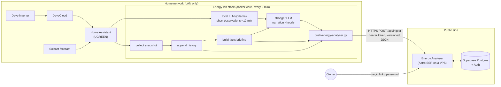

# Architecture

How Energy Analyser fits together: where data comes from, where it is processed, and what the app itself does. For the rules the app applies to the data see [logic.md](logic.md); for why things are built this way see [decisions.md](decisions.md); for everything that has to exist outside this repo see [prerequisites.md](prerequisites.md).

## The idea in one paragraph

The owner of a home solar system (PV panels, a battery, the grid, a Deye inverter, a PGE G11 tariff) wants to know each day what the battery should do and whether usage is normal, in words a non-expert understands. The home lab already collects the telemetry and runs the advisory logic. This app is the part the owner opens: it signs the owner in, stores what the lab pushes, applies its own season-aware rules, and presents the result. It never controls any device.

## Data flow

- **Push, never pull.** The home network is LAN-only. The lab sends public-safe data outbound; the app never connects into the home.
- **The lab computes, the app presents.** Telemetry collection, PGE bill math and LLM narration stay in the lab. The app adds access control, storage, its own season-aware rules and the user interface.
- **Advisory only.** Nothing in the app or the push path writes to Home Assistant or the inverter.

## Inside the app

| Layer      | What it does                                                                                                                          | Where                                                   |
| ---------- | ------------------------------------------------------------------------------------------------------------------------------------- | ------------------------------------------------------- |
| Pages      | Server-rendered Astro pages; the dashboard shows live state, the usage insight and today's recommendation, each loading independently | `src/pages/`, `src/components/`                         |
| Middleware | Resolves the signed-in user, protects pages, checks the `Origin` header on mutating API calls (except bearer-token ingest)            | `src/middleware.ts`                                     |
| Services   | Pure, unit-tested functions that turn rows into view models (staleness, baselines, labels) plus thin Supabase loaders                 | `src/lib/services/`                                     |
| Ingest     | Validates the lab's payload against a strict versioned contract and stores it through one database function                           | `src/pages/api/ingest.ts`, `src/lib/ingest/contract.ts` |
| Database   | Tables for raw pushes (kept 14 days), per-day energy totals, recommendations; owner-only reads                                        | `supabase/migrations/`                                  |

## Security model

- **No service-role key.** The app only has the public anon key. Writes from the lab go through `public.ingest_push`, a `SECURITY DEFINER` function that checks the bearer token against SHA-256 hashes; clients have no table privileges at all.
- **Owner-only reads.** Every readable table or view needs both an explicit grant and a row-level-security policy that checks `public.app_owners`. Anyone else, signed in or not, reads nothing.
- **No sign-up in production.** The owner signs in with an emailed magic link or a password; accounts are not created from the app.
- **Nothing private leaves the lab.** Raw bills, customer/meter IDs, hourly readings, device names, addresses and tokens stay in the home lab; only aggregates, the facts bundle and narrated text are pushed.

## The two LLMs

| Model                                                | Where                      | Role                                                                                                                                                                          |
| ---------------------------------------------------- | -------------------------- | ----------------------------------------------------------------------------------------------------------------------------------------------------------------------------- |
| Local (Ollama `gemma3:4b`)                           | docker-core                | Probes often: short observations every ~12 minutes into a local notes file. Never writes user-facing text directly.                                                           |
| Stronger (OpenRouter `gpt-4.1-mini`, then fallbacks) | cloud, called from the lab | Interprets the verified facts and the local notes into every text the owner reads: the daily recommendation now; plain-language explanations and day/month summaries planned. |

Both only narrate numbers the deterministic rules computed; they never introduce facts of their own. The app never calls an LLM, so opening a page never waits for one.

## Delivery

GitHub Actions runs lint, unit tests, type checks, a build and a smoke test against a local Supabase on every push and pull request. Merges to `main` publish an immutable image to GHCR; production deploys are manual through a protected environment. Lab changes live in the separate homelab-2 repository and are installed on docker-core with its runbook.
