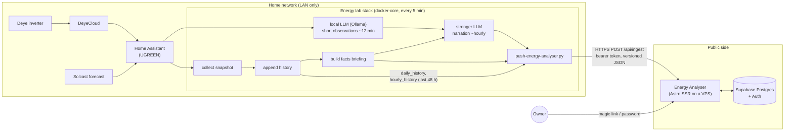

# Architecture

How Energy Analyser fits together: where data comes from, where it is processed, and what the app itself does. For the rules the app applies to the data see [logic.md](logic.md); for why things are built this way see [decisions.md](decisions.md); for everything that has to exist outside this repo see [prerequisites.md](prerequisites.md).

## The idea in one paragraph

The owner of a home solar system (PV panels, a battery, the grid, a Deye inverter, a PGE G11 tariff) wants to know each day what the battery should do and whether usage is normal, in words a non-expert understands. The home lab already collects the telemetry and runs the advisory logic. This app is the part the owner opens: it signs the owner in, stores what the lab pushes, applies its own season-aware rules, and presents the result. It never controls any device.

## Data flow

```mermaid
flowchart LR
  subgraph Home["Home network (LAN only)"]
    Deye[Deye inverter] --> DC[DeyeCloud]
    HA["Home Assistant<br/>(UGREEN)"]
    DC --> HA
    Solcast[Solcast forecast] --> HA
    subgraph Lab["Energy lab stack (docker-core, every 5 min)"]
      Snap[collect snapshot] --> Hist[append history]
      Hist --> Brief[build facts briefing]
      Micro["local LLM (Ollama)<br/>short observations ~12 min"] --> Adv
      Brief --> Adv["stronger LLM<br/>narration ~hourly"]
      Adv --> Push[push-energy-analyser.py]
      Brief --> Push
      Hist -- "daily_history,<br/>hourly_history (last 48 h)" --> Push
    end
    HA --> Snap
    HA --> Micro
  end
  Push -- "HTTPS POST /api/ingest<br/>bearer token, versioned JSON" --> App
  subgraph Cloud["Public side"]
    App["Energy Analyser<br/>(Astro SSR on a VPS)"] <--> DB[(Supabase Postgres<br/>+ Auth)]
  end
  Owner((Owner)) -- "magic link / password" --> App
```

- **Push, never pull.** The home network is LAN-only. The lab sends public-safe data outbound; the app never connects into the home.
- **The lab computes, the app presents.** Telemetry collection, PGE bill math and LLM narration stay in the lab. The app adds access control, storage, its own season-aware rules and the user interface.
- **Stored by the push.** `public.ingest_push` keeps each raw push for 14 days and upserts what it carries: `daily_energy` from `daily_history`, `hourly_energy` from `hourly_history` (per clock hour, kept 35 days), and `recommendations`. The newer capture wins for days and hours.
- **Advisory only.** Nothing in the app or the push path writes to Home Assistant or the inverter.

## Inside the app

| Layer      | What it does                                                                                                                                                                                                                                                                                                                                         | Where                                                                                                  |
| ---------- | ---------------------------------------------------------------------------------------------------------------------------------------------------------------------------------------------------------------------------------------------------------------------------------------------------------------------------------------------------- | ------------------------------------------------------------------------------------------------------ |
| Pages      | Server-rendered Astro pages; the dashboard shows live state, the usage insight and today's recommendation, each loading independently                                                                                                                                                                                                                | `src/pages/`, `src/components/`                                                                        |
| History    | `/dashboard/history`: a day, month or quarter from the URL; loads only that period's rows, each section failing on its own; no script                                                                                                                                                                                                                | `src/pages/dashboard/history.astro`, `src/components/history/`, `src/lib/calendar/`                    |
| Middleware | Resolves the signed-in user, protects pages, checks the `Origin` header on mutating API calls (except bearer-token ingest)                                                                                                                                                                                                                           | `src/middleware.ts`                                                                                    |
| Services   | Pure, unit-tested functions that turn rows into view models (staleness, baselines, labels) plus thin Supabase loaders; the calendar's range loaders read `daily_energy` by day range, recommendation times (at most 1000) for a month and full recommendations for one day, and `day_notes` gives the note for one day and the noted days of a month | `src/lib/services/`, `src/lib/services/calendar-data.ts`                                               |
| Notes      | `POST /api/notes`: the owner's one note per day, saved, changed or deleted from the history day view with plain forms; the route checks the session and wires in the Supabase writes; a pure service validates the form, runs the save (`saveNote`) and picks the redirect                                                                           | `src/pages/api/notes.ts`, `src/lib/services/day-notes.ts`, `src/components/history/DayNotePanel.astro` |
| Ingest     | Validates the lab's payload against a strict versioned contract and stores it through one database function                                                                                                                                                                                                                                          | `src/pages/api/ingest.ts`, `src/lib/ingest/contract.ts`                                                |
| Database   | Tables for raw pushes (14 days), daily and hourly (`hourly_energy`, 35 days) energy totals, recommendations, owner-only reads; `day_notes`, the one table the signed-in owner writes                                                                                                                                                                 | `supabase/migrations/`                                                                                 |

Both signed-in pages share `AppShell.astro`: the header with the brand `h1` and the "Pulpit / Historia" navigation, one `<main>` and the legend footer. The history page reads `daily_energy`, `recommendations` and the owner's `day_notes`, through owner-only grants, and makes no hourly query.

## Security model

- **No service-role key.** The app only has the public anon key. Writes from the lab go through `public.ingest_push`, a `SECURITY DEFINER` function that checks the bearer token against SHA-256 hashes; clients have no privileges on the ingest tables at all.
- **Owner-only reads.** Every readable table or view needs both an explicit grant and a row-level-security policy that checks `public.app_owners`. Anyone else, signed in or not, reads nothing.
- **One owner-written table: `day_notes`.** Day notes (S-19, migration `20261001072438_day_notes.sql`) are the only rows a signed-in client creates, changes or deletes. The table is locked down like the others (RLS on, `revoke all` from `anon` and `authenticated`) and then opened per operation, by column:
  - **Grants to `authenticated`:** `select (day, text, created_at, updated_at)`, `insert (day, text)`, `update (text)` and `delete`. `anon` gets nothing.
  - **The author is set by the database.** `user_id` defaults to `auth.uid()` and is never granted, for reading or writing, so a client cannot write a note for someone else even if a policy were wrong; `id` is not readable either.
  - **Four policies, one per operation** ("owners can read / add / change / delete their day notes"), each requiring both the author (`user_id = (select auth.uid())`) and the owner check against `public.app_owners`, in `using` and/or `with check` as the operation needs.
  - **`updated_at`** is set by a `security invoker` BEFORE UPDATE trigger with an empty `search_path`; EXECUTE on its function is revoked from `public`, `anon` and `authenticated`, since triggers fire without it.
  - **Text rules in the database too:** at most 500 characters and not blank after trimming (`check`), and one note per user and day (`unique (user_id, day)`).
- **Writes only through `POST /api/notes`.** The route sits under `/api/`, so the middleware's `Origin` check applies to it (it is not a bearer-token route), and it checks the session itself, because the protected prefix covers pages only: signed out, it redirects to `/auth/signin` and writes nothing. Every answer is a 303 back to the day. It saves (`saveNote` in `src/lib/services/day-notes.ts`) by updating the day's note and inserting one when no row changed (retrying once as an update if a concurrent insert hits the unique constraint, SQLSTATE `23505`); it cannot upsert, because the conflict target `(user_id, day)` includes a column the client may neither read nor write.
- **Notes never leave the app.** Nothing sends them to the lab or to an LLM, and they never change ratings, summaries or recommendations.
- **No sign-up in production.** The owner signs in with an emailed magic link or a password; accounts are not created from the app.
- **Nothing private leaves the lab.** Raw bills, customer/meter IDs, 5-minute and instantaneous history readings, device names, addresses and tokens stay in the home lab; only aggregates (daily totals and per-clock-hour totals), the facts bundle and narrated text are pushed.

## The two LLMs

| Model                                                | Where                      | Role                                                                                                                                                                          |
| ---------------------------------------------------- | -------------------------- | ----------------------------------------------------------------------------------------------------------------------------------------------------------------------------- |
| Local (Ollama `gemma3:4b`)                           | docker-core                | Probes often: short observations every ~12 minutes into a local notes file. Never writes user-facing text directly.                                                           |
| Stronger (OpenRouter `gpt-4.1-mini`, then fallbacks) | cloud, called from the lab | Interprets the verified facts and the local notes into every text the owner reads: the daily recommendation now; plain-language explanations and day/month summaries planned. |

Both only narrate numbers the deterministic rules computed; they never introduce facts of their own. The app never calls an LLM, so opening a page never waits for one.

## Delivery

GitHub Actions runs lint, unit tests, type checks, a build and a smoke test against a local Supabase on every push and pull request. Merges to `main` publish an immutable image to GHCR; production deploys are manual through a protected environment. Lab changes live in the separate homelab-2 repository and are installed on docker-core with its runbook.
