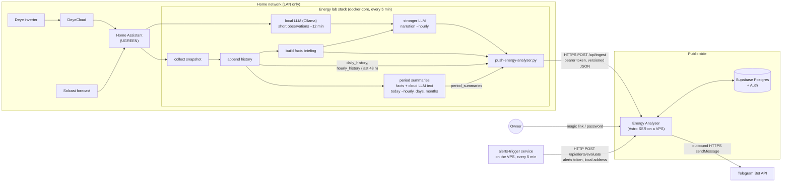

# Architecture

How Energy Analyser fits together: where data comes from, where it is processed, and what the app itself does. For the rules the app applies to the data see [logic.md](logic.md); for why things are built this way see [decisions.md](decisions.md); for everything that has to exist outside this repo see [prerequisites.md](prerequisites.md).

## The idea in one paragraph

The owner of a home solar system (PV panels, a battery, the grid, a Deye inverter, a PGE G11 tariff) wants to know each day what the battery should do and whether usage is normal, in words a non-expert understands. The home lab already collects the telemetry and runs the advisory logic. This app is the part the owner opens: it signs the owner in, stores what the lab pushes, applies its own season-aware rules, and presents the result. It never controls any device.

## Data flow

```mermaid
flowchart LR
  subgraph Home["Home network (LAN only)"]
    Deye[Deye inverter] --> DC[DeyeCloud]
    HA["Home Assistant<br/>(UGREEN)"]
    DC --> HA
    Solcast[Solcast forecast] --> HA
    subgraph Lab["Energy lab stack (docker-core, every 5 min)"]
      Snap[collect snapshot] --> Hist[append history]
      Hist --> Brief[build facts briefing]
      Micro["local LLM (Ollama)<br/>short observations ~12 min"] --> Adv
      Brief --> Adv["stronger LLM<br/>narration ~hourly"]
      Adv --> Push[push-energy-analyser.py]
      Brief --> Push
      Hist -- "daily_history,<br/>hourly_history (last 48 h)" --> Push
      Hist --> Sum["period summaries<br/>facts + cloud LLM text<br/>today ~hourly, days, months"]
      Sum -- "period_summaries" --> Push
    end
    HA --> Snap
    HA --> Micro
  end
  Push -- "HTTPS POST /api/ingest<br/>bearer token, versioned JSON" --> App
  subgraph Cloud["Public side"]
    App["Energy Analyser<br/>(Astro SSR on a VPS)"] <--> DB[(Supabase Postgres<br/>+ Auth)]
  end
  Owner((Owner)) -- "magic link / password" --> App
  Cron["alerts-trigger service<br/>on the VPS, every 5 min"] -- "HTTP POST /api/alerts/evaluate<br/>alerts token, local address" --> App
  App -- "outbound HTTPS sendMessage" --> TG["Telegram Bot API"]
```

- **Push, never pull.** The home network is LAN-only. The lab sends public-safe data outbound; the app never connects into the home.
- **The lab computes, the app presents.** Telemetry collection, PGE bill math and LLM narration stay in the lab. The app adds access control, storage, its own season-aware rules and the user interface.
- **Stored by the push.** `POST /api/ingest` first calls `public.ingest_token_ok`, which answers whether the token is live, and reads the body only after that. `public.ingest_push` then checks the token again, with one helper per section in the non-exposed `ingest` schema (`store_daily`, `store_hourly`, `store_period_summaries`, `store_recommendation`, `prune`). It keeps each raw push for 14 days and upserts what it carries: `daily_energy` from `daily_history`, `hourly_energy` from `hourly_history` (per clock hour, kept 35 days), `period_summaries` from `period_summaries` (one row per today/day/month period, kept), and `recommendations`. The newer capture wins for days and hours; the newer `built_at` wins for period summaries.
- **Advisory only.** Nothing in the app or the push path writes to Home Assistant or the inverter.

## Inside the app

| Layer      | What it does                                                                                                                                                                                                                                                                                                                                         | Where                                                                                                                                                                      |
| ---------- | ---------------------------------------------------------------------------------------------------------------------------------------------------------------------------------------------------------------------------------------------------------------------------------------------------------------------------------------------------- | -------------------------------------------------------------------------------------------------------------------------------------------------------------------------- |
| Pages      | Server-rendered Astro pages; the dashboard shows live state, the usage insight, today's recommendation and the lab's explanation of today (`TodaySummaryCard`), each loading independently                                                                                                                                                           | `src/pages/`, `src/components/`                                                                                                                                            |
| History    | `/dashboard/history`: a day, month or quarter from the URL; loads only that period's rows, each section failing on its own; a completed day or month shows the lab's text in `SummaryPanel`; no script                                                                                                                                               | `src/pages/dashboard/history.astro`, `src/components/history/`, `src/lib/calendar/`                                                                                        |
| Middleware | Resolves the signed-in user, protects pages, checks the `Origin` header on mutating API calls (except the two bearer-token routes, `/api/ingest` and `/api/alerts/evaluate`)                                                                                                                                                                         | `src/middleware.ts`                                                                                                                                                        |
| Services   | Pure, unit-tested functions that turn rows into view models (staleness, baselines, labels) plus thin Supabase loaders; the calendar's range loaders read `daily_energy` by day range, recommendation times (at most 1000) for a month and full recommendations for one day, and `day_notes` gives the note for one day and the noted days of a month | `src/lib/services/` (`period-summary.ts` for the lab's texts), `src/lib/services/calendar-data.ts`                                                                         |
| Notes      | `POST /api/notes`: the owner's one note per day, saved, changed or deleted from the history day view with plain forms; the route checks the session and wires in the Supabase writes; a pure service validates the form, runs the save (`saveNote`) and picks the redirect                                                                           | `src/pages/api/notes.ts`, `src/lib/services/day-notes.ts`, `src/components/history/DayNotePanel.astro`                                                                     |
| Ingest     | Validates the lab's payload against a strict versioned contract and stores it through one database function                                                                                                                                                                                                                                          | `src/pages/api/ingest.ts`, `src/lib/ingest/contract.ts`                                                                                                                    |
| Alerts     | `/dashboard/alerts` and `POST /api/alert-rules`: the owner's rules (a second owner-written table, `alert_rules`, plain forms, no script). `POST /api/alerts/evaluate`: the scheduled evaluator that reads a snapshot, decides in pure code, sends to Telegram and records what went out ([Alert notifications](#alert-notifications))                | `src/pages/dashboard/alerts.astro`, `src/pages/api/alert-rules.ts`, `src/pages/api/alerts/evaluate.ts`, `src/lib/services/alert-*.ts`, `alerts-evaluate.ts`, `telegram.ts` |
| Database   | Tables for raw pushes (14 days), daily and hourly (`hourly_energy`, 35 days) energy totals, recommendations, the lab's period summaries (`period_summaries`, one row per period, latest `built_at` wins; shown as text only, `facts` never), owner-only reads; `day_notes`, the one table the signed-in owner writes                                 | `supabase/migrations/`                                                                                                                                                     |

Both signed-in pages share `AppShell.astro`: the header with the brand `h1` and the "Pulpit / Historia" navigation, one `<main>` and the legend footer. The history page reads `daily_energy`, `recommendations` and the owner's `day_notes`, through owner-only grants, and makes no hourly query.

## Security model

- **No service-role key.** The app only has the public anon key, and `src/lib/anon-key.ts` classifies the configured key: a key that is not an `sb_publishable_` key or an anon JWT (a secret or `service_role` key, another role, an opaque string, surrounding whitespace) is refused when a client is created, with a message that never contains the key. Writes from the lab go through `public.ingest_push`, a `SECURITY DEFINER` function that checks the bearer token against SHA-256 hashes; clients have no privileges on the ingest tables at all. The only other public function on this path is `public.ingest_token_ok`, a boolean token check that the route calls before it reads the body; the `ingest` helper schema is not exposed to clients.
- **Owner-only reads.** Every readable table or view needs both an explicit grant and a row-level-security policy that checks `public.app_owners`. Anyone else, signed in or not, reads nothing.
- **One owner-written table: `day_notes`.** Day notes (S-19, migration `20261001072438_day_notes.sql`) are the only rows a signed-in client creates, changes or deletes. The table is locked down like the others (RLS on, `revoke all` from `anon` and `authenticated`) and then opened per operation, by column:
  - **Grants to `authenticated`:** `select (day, text, created_at, updated_at)`, `insert (day, text)`, `update (text)` and `delete`. `anon` gets nothing.
  - **The author is set by the database.** `user_id` defaults to `auth.uid()` and is never granted, for reading or writing, so a client cannot write a note for someone else even if a policy were wrong; `id` is not readable either.
  - **Four policies, one per operation** ("owners can read / add / change / delete their day notes"), each requiring both the author (`user_id = (select auth.uid())`) and the owner check against `public.app_owners`, in `using` and/or `with check` as the operation needs.
  - **`updated_at`** is set by a `security invoker` BEFORE UPDATE trigger with an empty `search_path`; EXECUTE on its function is revoked from `public`, `anon` and `authenticated`, since triggers fire without it.
  - **Text rules in the database too:** at most 500 characters and not blank after trimming (`check`), and one note per user and day (`unique (user_id, day)`).
- **Writes only through `POST /api/notes`.** The route sits under `/api/`, so the middleware's `Origin` check applies to it (it is not a bearer-token route), and it checks the session itself, because the protected prefix covers pages only: signed out, it redirects to `/auth/signin` and writes nothing. Every answer is a 303 back to the day. It saves (`saveNote` in `src/lib/services/day-notes.ts`) by updating the day's note and inserting one when no row changed (retrying once as an update if a concurrent insert hits the unique constraint, SQLSTATE `23505`); it cannot upsert, because the conflict target `(user_id, day)` includes a column the client may neither read nor write.
- **Notes never leave the app.** Nothing sends them to the lab or to an LLM, and they never change ratings, summaries or recommendations.
- **A second owner-written table: `alert_rules`** (migration `20261007090000_alert_rules.sql`), hardened like `day_notes`: RLS on, `revoke all`, four per-operation owner policies, `user_id` defaulted by the database and unreadable. The client may read everything else, insert and change only a rule's own settings (`threshold`, `label`, `enabled`, `renotify_hours`; `kind` only on insert) and delete; the evaluator-owned columns (`state`, `last_notified_at`, `last_evaluated_at`, `unevaluable_reason`) are not client-writable. Edits and deletes target the row `id`, which is readable, unlike `day_notes`. Writes go only through `POST /api/alert-rules`, behind the `Origin` check and a session check.
- **The alerts token and its scope.** The evaluator has no session and no service-role key, so it reads and writes only through two anon-callable `SECURITY DEFINER` functions (`search_path = ''`, EXECUTE restated): `alerts_snapshot` (the enabled rules, the newest live push and the newest push with a bill forecast) and `alerts_record` (writes back only the evaluator-owned columns of existing rules). Both check the bearer token against SHA-256 hashes in `alert_tokens`, a table separate from `ingest_tokens` with no client privileges at all, and answer the same error for an unknown and a revoked token. So a leaked alerts token cannot forge pushes, and an ingest token cannot evaluate or record. The token's scope is: read the rules and the two newest pushes (data the owner already reads), write rule state. It evaluates all owners' enabled rules, on the single-owner assumption.
- **No sign-up in production.** The owner signs in with an emailed magic link or a password; accounts are not created from the app.
- **Nothing private leaves the lab.** Raw bills, customer/meter IDs, 5-minute and instantaneous history readings, device names, addresses and tokens stay in the home lab; only aggregates (daily totals and per-clock-hour totals), the facts bundle and narrated text are pushed.

## Alert notifications

The one outbound call the app makes, and its second token route. A small `alerts-trigger` service next to the app on the production host (`compose.yaml`, `scripts/alerts-trigger.mjs`, every 5 minutes, its own token `alerts-vps` and the app's local address from `.env.alerts`) POSTs to `/api/alerts/evaluate`; the GitHub workflow `.github/workflows/alerts-evaluate.yml` is only a manual trigger, with the token `alerts-prod`. The rules and transitions are in [logic.md](logic.md#alert-rules).

- **Second token route.** `/api/alerts/evaluate` is an exact-path member of `TOKEN_AUTH_ROUTES` beside `/api/ingest`, so it skips the `Origin` check and the session lookup; it is bearer-authenticated and never uses cookies. A missing, unknown or revoked token gets one uniform 401 before any work. With a valid token but no Telegram configuration the route answers 503 `telegram_not_configured` and records nothing.
- **Flow.** `alerts_snapshot` returns the rules and the two pushes in the shape the loaders produce, so the app's own view mappers apply; a pure evaluator decides each rule; the route sends one `sendMessage` per due message and then calls `alerts_record` for what actually went out. A failed send is left unrecorded and retried by the next run. A rule that cannot be evaluated is recorded with its reason and its old state.
- **New outbound boundary: Telegram.** The VPS calls `https://api.telegram.org` (`sendMessage` only, 10-second timeout, `src/lib/services/telegram.ts`), the first call from the app to anything outside Supabase. The app never polls `getUpdates`, sets a webhook or runs commands. It reuses the lab's bot (`@funky_homelab_bot`) by the owner's decision, so `TELEGRAM_BOT_TOKEN` and `TELEGRAM_CHAT_ID` sit in `.env.runtime` on the public VPS (declared optional server secrets in `astro.config.mjs`), a risk the owner accepted (`decisions.md`, 2026-10-06 (alert rules)). The token sits in the request URL, so an error is reduced to a status code or `timeout`/`network`; no token, chat id or message text is logged or returned, and the JSON answer holds counts only.
- **Independent of the lab.** The evaluator reads what the lab already pushed, so it still works when the lab is down; the lab's own Uptime Kuma alert covers push silence, this covers stale or degraded data and the bill.

## The two LLMs

| Model                                                | Where                                                    | Role                                                                                                                                                                                                                                                                                                                            |
| ---------------------------------------------------- | -------------------------------------------------------- | ------------------------------------------------------------------------------------------------------------------------------------------------------------------------------------------------------------------------------------------------------------------------------------------------------------------------------- |
| Local (Ollama `gemma3:4b`)                           | docker-core                                              | Probes often: short observations every ~12 minutes into a local notes file. Never writes user-facing text directly.                                                                                                                                                                                                             |
| Stronger (OpenRouter `gpt-4.1-mini`, then fallbacks) | cloud, called from the lab                               | Interprets the verified facts and the local notes into every text the owner reads: the daily recommendation, with the fallback chain.                                                                                                                                                                                           |
| OpenRouter `gpt-4.1-mini` only, no fallback          | cloud, called from the lab (`build-period-summaries.py`) | Period summaries (F-04): the plain-language explanation of today (about hourly) and the summary of each completed day and month, from a facts bundle only (no local notes), describing and never advising. When the call fails the facts are pushed with no text, and a later run fills it in; Ollama never writes these texts. |

Both only narrate numbers the deterministic rules computed; they never introduce facts of their own. The app never calls an LLM, so opening a page never waits for one.

## Observability

Failures are visible in the container's stderr as JSON lines, one per event (`src/lib/logger.ts`): `ts`, `level`, `event`, `version`, `env`, and, from the middleware's per-request child logger, `requestId`, `method` and `path` (no query string). There is no tracker yet; the lines are tracker-agnostic so one can read them later.

- **Request id.** `src/middleware.ts` creates (or accepts a well-formed inbound) id, sets `locals.requestId` and `locals.log`, and returns it as `X-Request-Id`. Anything unhandled is logged as `unhandled_error` with the id and rethrown, so Astro still renders its 500.
- **Section failures.** Loaders throw `queryError(...)` (keeps the Postgres code as `cause`); `orLoadError` on the dashboard and history pages logs `section_load_failed` with the section label and returns null, so a section fails alone.
- **Auth outage.** The middleware reads the `getUser()` error; `src/lib/auth-outage.ts` decides. A provider outage on a page that needs the owner is a 503 with a request id; a missing session is a normal redirect.
- **Privacy.** Emails are logged only as an 8-character hash; tokens and query strings never.

## Delivery

GitHub Actions runs lint, unit tests, type checks, a build and a smoke test against a local Supabase on every push and pull request. Merges to `main` publish an immutable image to GHCR; production deploys are manual through a protected environment. The alert route is called every 5 minutes by the `alerts-trigger` service on the production host; `alerts-evaluate.yml` is only a manual trigger. Lab changes live in the separate homelab-2 repository and are installed on docker-core with its runbook.
